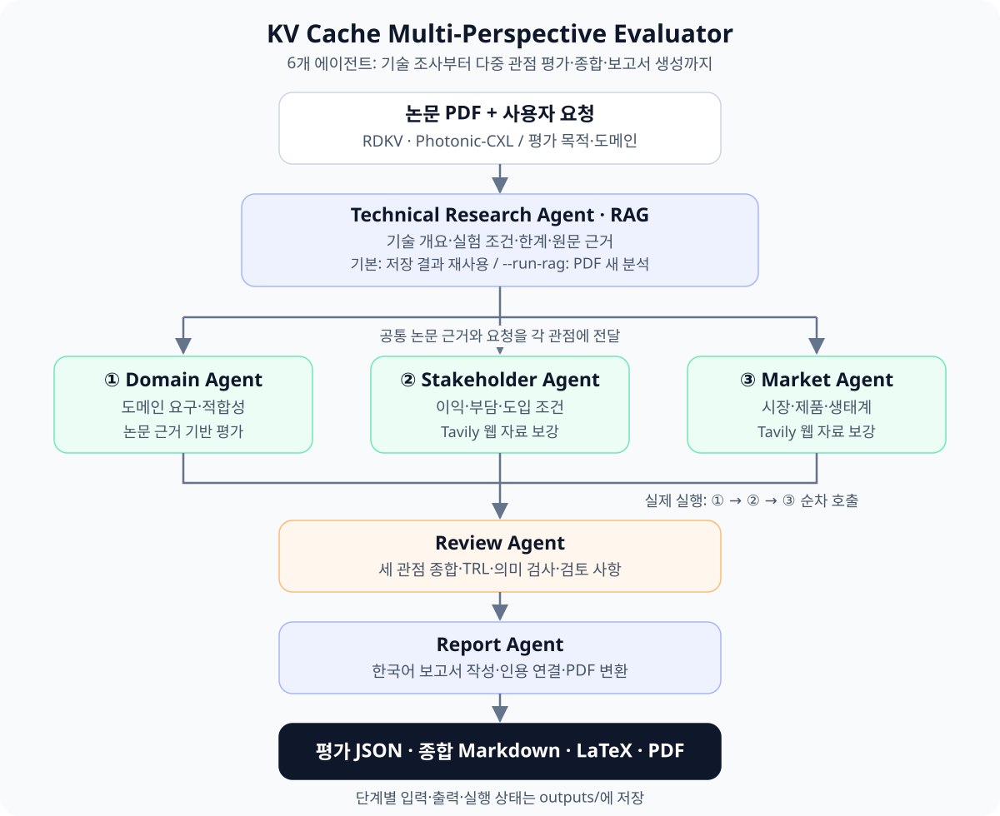

# Subject

본 프로젝트는 KV cache 최적화 기술을 소프트웨어(SW)·하드웨어(HW) 진영에서 각각 선정하고, 시장·이해관계자·도메인 관점에서 비교 평가하는 **Multi-Agent 기반 Agentic RAG**를 개발하는 프로젝트입니다.

논문 PDF와 사용자의 자연어 요청을 입력받아 기술 근거를 추출하고, 관점별 평가와 종합 검토를 거쳐 한국어 기술 평가 보고서 PDF를 생성합니다.

## Overview

- **Objective** : 각 기술을 복수 관점에서 평가하고, SW·HW 접근의 기대 효과·도입 부담·적용 조건을 비교
- **Method** : 역할을 분리한 Multi-Agent + Agentic RAG — 현재 통합 실행기는 관점별 에이전트를 순차 호출
- **Tools** : 논문 PDF 분석, BGE-M3 기반 검색, Tavily 웹 검색·본문 수집, 구조화 출력 및 근거 검증, LaTeX·PDF 생성
- **Target Domain** : 장문맥 문서 QA를 제공하는 데이터센터·클라우드 서빙
- **Output** : 관점별 평가 JSON, 종합 Markdown, LaTeX 원본, 최종 보고서 PDF

## Selected Technologies

- **SW : RDKV** — KV cache의 제거(eviction)와 양자화(quantization)를 함께 고려하는 비트 할당 기반 압축 기술입니다. 메모리 사용량을 줄이는 소프트웨어 접근에서 품질·지연 시간·적용 조건의 관계를 평가하기 위해 선정했습니다.
- **HW : Photonic-CXL** — 광 연결과 CXL 기반 공유 메모리 장치를 활용하는 KV cache 관리 기술입니다. 메모리 확장·공유 접근의 기대 효과와 하드웨어 도입·통합 부담을 평가하기 위해 선정했습니다.

두 기술은 같은 KV cache 문제에 서로 다른 방식으로 접근합니다. 논문별 실험 조건과 검증 수준을 함께 비교하며, Photonic-CXL의 서빙 성능 전망은 에뮬레이션·시뮬레이션 근거와 실제 장치 검증을 구분합니다. 입력 논문 정보는 [논문 안내](rag/papers/README.md)에서 확인할 수 있습니다.

## Features

- **PDF 기반 정보 추출** : 논문의 기술 개요·적용 범위·한계·실험 조건을 추출하고, 페이지·문장·표·그림의 원문 근거와 연결
- **Agentic RAG** : 논문 검색·분석·근거 감사를 수행하고, 분석 결과와 검색 기록을 후속 에이전트에 전달
- **다중 관점 평가** : 시장성, 이해관계자의 이익·부담, 도메인 적합성을 같은 논문 근거와 사용자 요청에 따라 평가
- **외부 자료 보강** : 시장·이해관계자 평가에서 웹 자료를 수집하고, 논문 자체의 결과와 시장·운영 배경 자료를 구분
- **확증 편향 방지 전략** : 수집된 근거에서 유리한 결과와 반대 근거·한계·도입 부담을 함께 검토하고, 저자 주장·관찰 결과·분석자의 추론을 구분. 근거가 부족한 항목은 미확인으로 남기며, 종합 의견의 근거 연결과 의미를 별도로 검사
- **보고서 생성** : 관점별 평가와 종합 의견을 한국어 보고서로 작성하고, 본문에서 사용한 출처를 참고문헌에 연결
- **결과 추적·재개** : 단계별 입력·출력과 실행 상태를 저장하고, 중단된 실행을 재개하거나 특정 단계를 다시 실행

## Tech Stack

- **Framework** : LangGraph, LangChain, Pydantic — 에이전트 내부 흐름·구조화 출력·검증에 사용하며 전체 단계는 Python 통합 실행기로 연결
- **LLM/Generator** : 통합 평가·종합·보고서 기본 모델 `gpt-4.1-mini`; 별도 RAG 실행 기본 모델 `gpt-5.6-terra`
- **LLM/Judge** : 종합 의견 의미 검사 기본 모델 `gpt-4.1-mini`; RAG 근거 감사 기본 모델 `gpt-5.6-terra` — 생성과 검증에 별도 프롬프트 사용
- **Retrieval** : Chroma 벡터 저장소 + Dense·Sparse 결합 검색 + ColBERT 재순위화·MMR / **Hit Rate@K, MRR : 측정 결과 미기록**
- **Embedding** : 오픈소스 `BAAI/bge-m3` — 고정 revision의 로컬 모델 사용
- **PDF Parsing** : PyMuPDF, pdfplumber
- **Web Search** : Tavily
- **Report** : Markdown → LaTeX → PDF, XeLaTeX 또는 Tectonic
- **Runtime** : Python 3.12, uv — 통합 실행 환경과 RAG 실행 환경 분리

모델명은 코드의 기본 설정 기준입니다. 통합 실행 모델은 `--model`로 변경할 수 있으며, RAG 모델 설정은 `rag/`에서 별도로 관리합니다.

## Agents

`agent/`는 다음 4개 에이전트로 구성됩니다.

| Agent | 역할 |
| --- | --- |
| **Domain Agent** | 논문 근거를 바탕으로 메모리 용량·품질·지연·처리량·호환성 등 도메인 요구에 대한 적합성 평가 |
| **Stakeholder Agent** | 운영 조직 등 이해관계자의 기대 이익·도입 및 운영 부담·수용 조건 평가 |
| **Market Agent** | 웹 자료를 보강하여 시장·제품·생태계와 기술 도입 조건 평가 |
| **Review Agent** | 세 관점의 결과와 근거를 연결하여 기술 성숙도(TRL)와 조건부 종합 의견을 도출하고 검토 사항 기록 |

앞단의 **Technical Research Agent**(`rag/`)는 논문 분석과 근거 검색을, 뒷단의 **Report Agent**(`report/`)는 보고서 작성과 PDF 변환을 담당합니다. 세부 역할은 [에이전트 안내](agent/README.md)를 참고하세요.

## Architecture



세 관점에는 같은 논문 자료와 사용자 요청을 각각 전달합니다. 현재 통합 실행 순서는 **Domain → Stakeholder → Market → Review → Report**입니다. 기본 RAG 모드는 저장 결과 재사용(`saved`)이며, `--run-rag`를 지정하면 입력 PDF를 새로 분석합니다.

## Directory Structure

```text
.
├── config/
│   └── pipeline.json         # 논문 경로·사용자 요청·평가 맥락·RAG 모드
├── pipeline/                 # 통합 실행기와 단계별 입력·출력 연결
│   └── __main__.py           # python -m pipeline 실행 진입점
├── rag/                      # Technical Research Agent와 별도 실행 환경
│   ├── papers/               # 입력 논문 PDF
│   ├── src/                  # PDF 분석·검색·근거 감사
│   └── examples/results/     # 재사용 가능한 논문 분석 결과
├── agent/                    # 에이전트 구현과 각 모듈의 프롬프트
│   ├── domain/               # 도메인 적합성 평가
│   ├── stakeholder/          # 이해관계자 평가
│   ├── market/               # 시장성 평가
│   └── review/               # 검증·종합
├── report/                   # 보고서 작성·LaTeX·PDF 생성
├── docs/                     # 상세 실행 안내와 아키텍처 이미지
├── outputs/                  # 실행별 입력·평가 결과·최종 보고서
├── .env.example              # API 키 설정 예시
├── pyproject.toml            # Python 3.12 통합 환경 의존성
└── README.md
```

## Usage

저장소 루트에서 실행합니다. Python 3.12와 uv를 준비하고, 루트 `.env` 또는 환경변수에 `OPENAI_API_KEY`, `TAVILY_API_KEY`를 설정합니다. 설정 항목은 [.env.example](.env.example)을 참고하세요. PDF 생성에는 XeLaTeX와 `kotex`, 또는 Tectonic이 필요합니다.

```bash
uv sync --frozen
uv run --frozen python -m pipeline
```

기본 입력은 [config/pipeline.json](config/pipeline.json)입니다. 기본 실행은 저장된 RAG 결과를 불러오며, 이후 평가·웹 검색·보고서 작성에서는 실제 API를 호출합니다. **새 자연어 요청은 후속 평가에 적용되며, 저장된 논문 분석 자체를 재생성하지는 않습니다.**

```bash
# 기본 saved 모드에서 외부 API 호출 없이 입력 준비만 확인
uv run --frozen python -m pipeline --stop-after prepare

# 사용자 요청과 출력 폴더 지정
uv run --frozen python -m pipeline \
  --instruction "장문맥 문서 QA를 제공하는 데이터센터·클라우드 서빙 관점에서 비교해줘." \
  --output outputs/my-report

# 같은 입력·모델·조사 기준일의 실행 재개
uv run --frozen python -m pipeline \
  --instruction "장문맥 문서 QA를 제공하는 데이터센터·클라우드 서빙 관점에서 비교해줘." \
  --output outputs/my-report --resume

# RAG 환경·임베딩 모델·입력 PDF 준비 후 논문부터 새로 분석
uv run --frozen python -m pipeline --run-rag --output outputs/fresh-report
```

기본 결과는 `outputs/integration/<실행 시각>/`에 저장됩니다. `--output`을 지정하면 해당 폴더에 `review.output.md`, `report.tex`, `report.pdf`와 단계별 JSON, 실행 기록 `run.json`이 생성됩니다. 기본 보고서는 근거와 검토 사항을 포함한 분석 초안이며, 자동 검토 미통과 항목은 검토 사항으로 남습니다.

RAG 환경 준비는 [RAG 안내](rag/README.md), 단계별 실행·재개 옵션은 [파이프라인 안내](docs/pipeline.md)를 참고하세요.

## Contributors

- 김광현 (P210): 이해관계자 평가 에이전트 개발
- 박정빈 (P218): 도메인 평가 에이전트 개발
- 백순철 (P221): 평가 종합 에이전트 개발
- 이지석 (P228): 기술 조사 에이전트 개발
- 이현정 (P230): 보고서 생성 에이전트 개발
- 정회륜 (P237): 시장 평가 에이전트 개발
