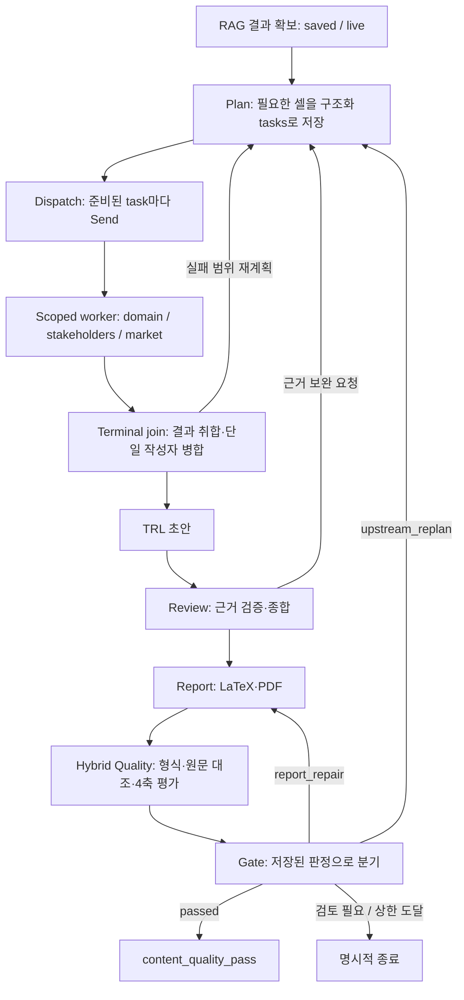

# KV Cache Multi-Perspective Evaluator

논문 PDF와 사용자의 자연어 요청을 받아 KV cache 최적화 기술을 기술 성숙도(TRL)·시장·이해관계자·도메인 관점에서 평가하고 한국어 보고서 PDF를 작성합니다. 대상은 장문맥 문서 QA를 제공하는 데이터센터·클라우드 서빙 운영 조직입니다.

이 브랜치의 통합 실행기는 **LangGraph Orchestrator–Workers(OW)**입니다. 저장된 조사 결과 또는 새 RAG 결과를 확보한 뒤, 필요한 평가 셀을 계획하고 해당 범위의 worker를 실행합니다. 보고서 생성 뒤에는 별도의 **Hybrid Quality** 평가와 제한된 수정 루프를 거칩니다.

판교 7반 2조의 [제출 README](docs/submission/README.md)에 필수 항목·State 일곱 항목·재현 방법과 증빙 범위를 모았습니다. [9쪽 보고서 원문](docs/submission/report.md)은 근거 편집 정리본이며 자동 Quality 통과 산출물이 아닙니다. LangSmith에는 합성 모델 경계를 사용한 실제 그래프 제어 테스트를 기록했습니다. 현재 OpenAI 키의 모델 접근 오류로 새 live 보고서와 독립 AI 평가는 미완료입니다.

## Selected Technologies

- **SW: RDKV** — 제거(eviction)와 양자화(quantization)를 함께 고려하는 비트 할당 기반 KV cache 압축 기술.
- **HW: Photonic-CXL** — 광 연결과 CXL 기반 공유 메모리 장치를 활용하는 KV cache 관리 기술.

같은 KV 용량 문제를 데이터량 감소와 저장 공간 확장으로 각각 풀기 때문에 선정했습니다. 압축 품질·커널 호환성과 외부 메모리 대역폭·배포 비용·검증 수준을 같은 조건표에서 비교합니다.

논문별 실험 조건·한계·검증 방식을 함께 기록합니다. 시뮬레이션·에뮬레이션 결과와 실제 장치·운용 검증을 구분하며, 특정 기술을 추천하거나 우열을 확정하는 보고서를 목표로 하지 않습니다. 입력 논문은 [논문 안내](rag/papers/README.md)를 참고하세요.

## Pattern and Architecture

실제 코드의 단계별 동작은 [모델 구조 설명](docs/model-architecture.md)에 정리했습니다. 이번 브랜치의 수정·470개 회귀 테스트와 API 접근 오류로 미완료된 Report 8 실행은 [최신 검증 기록](docs/validation-20261007-quality-fix.md)에 구분해 기록했습니다.


```mermaid
flowchart TD
    RAG["RAG 결과 확보: saved / live"] --> Plan["Plan: 필요한 셀을 구조화 tasks로 저장"]
    Plan --> Dispatch["Dispatch: 준비된 task마다 Send"]
    Dispatch --> Worker["Scoped worker: domain / stakeholders / market"]
    Worker --> Join["Terminal join: 결과 취합·단일 작성자 병합"]
    Join --> TRL["TRL 초안"]
    TRL --> Review["Review: 근거 검증·종합"]
    Review --> Report["Report: LaTeX·PDF"]
    Report --> Quality["Hybrid Quality: 형식·원문 대조·4축 평가"]
    Quality --> Gate["Gate: 저장된 판정으로 분기"]
    Gate -->|"passed"| Done["content_quality_pass"]
    Gate -->|"report_repair"| Report
    Gate -->|"upstream_replan"| Plan
    Gate -->|"검토 필요 / 상한 도달"| Stop["명시적 종료"]
    Join -->|"실패 범위 재계획"| Plan
    Review -->|"근거 보완 요청"| Plan
```

### OW를 선택한 이유

세 관점은 같은 논문 자료와 사용자 요청을 읽으며 각각 평가할 수 있습니다. 필요한 작업을 실행 전에 계획하고 결과를 취합하는 OW가 이 경계에 맞습니다. worker끼리 직접 대화하거나 서로의 전체 출력을 누적하지 않습니다.

역할 이름은 catalog로 고정하지만 **실행할 task와 셀은 입력 상태·누락 범위·품질 피드백에 따라 결정**합니다. 이미 채택된 역할만 있으면 worker 없이 다음 단계로 진행하고, HW의 시장 `standardization` 한 셀에 대한 보완 요청은 그 범위의 task로 변환합니다. `Send` 수는 저장된 계획에서 계산합니다. 현재 worker는 다른 역할의 결과를 입력으로 소비하지 않으므로 planner의 역할 간 dependency 제안을 거부합니다. 매 단계 다음 에이전트를 고르는 Supervisor 패턴은 사용하지 않습니다.

강의 「7. AI Agent 설계 및 구축」의 PDF 72·77쪽(OW), 123·132·133쪽(State·fan-out/join), 79·162·166·168쪽(평가 루프·Gate·종료 상한)을 구현 근거로 삼았습니다. 페이지 대응과 State의 일곱 설계 고려사항은 [오케스트레이션 상세](docs/orchestration.md)에 정리했습니다.

## Roles and Modules

기존 여섯 업무 역할을 재사용하고, 통합 제어·TRL 초안·Quality를 별도 모듈로 둡니다.

| 업무 역할 | 구현 | 역할 |
| --- | --- | --- |
| 기술 조사 | `rag/` | 논문 분석·검색·원문 근거 확보 또는 저장 결과 제공 |
| 도메인 평가 | `agent/domain/` | 지정된 기술·기준의 서빙 적합성 평가 |
| 이해관계자 평가 | `agent/stakeholder/` | 지정된 기술의 운영 조직 이익·부담·도입 조건 평가 |
| 시장 평가 | `agent/market/` | 지정된 기술·기준의 시장·제품·생태계 조사 |
| 평가 종합 | `agent/review/` | 원문 연결·의미 검증·최종 팀 TRL 추정·조건부 종합 |
| 보고서 생성 | `report/` | 종합 결과를 한국어 LaTeX·PDF로 작성 |

| 통합 모듈 | 책임 |
| --- | --- |
| `pipeline/contracts.py`, `planner.py` | 작은 State 계약·catalog·구조화 작업 계획 |
| `pipeline/graph.py`, `worker_adapters.py` | 동적 Send·scope 전달·terminal join·선택적 병합·품질 라우팅 |
| `pipeline/artifacts.py`, `checkpoint.py` | SHA-256 참조·완료 캐시·SQLite 체크포인트 |
| `pipeline/governance.py` | 후속 API 호출·토큰 예약·시간 제한·실패 사용량 기록 |
| `pipeline/trl.py`, `review_bridge.py` | 기술별 TRL 초안·canonical 원문 연결·Review 전달 |
| `pipeline/reporting.py`, `report_quality.py` | 보고서 생성·원문 기반 Hybrid Quality 평가 |

## Quality and TRL

**Generator와 Judge는 별도 호출·프롬프트를 사용합니다.** Report가 작성한 주장 목록을 평가의 정답으로 사용하지 않고, Quality Judge가 최종 PDF의 텍스트에서 주장과 인용을 추출해 canonical 원문과 대조합니다. `--report-model`은 보고서 작성 모델, `--judge-model`은 Quality 평가 모델을 따로 지정하며, 둘 다 생략하면 `--model`을 사용합니다. 같은 모델이어도 생성과 평가의 책임은 분리되어 있습니다.

Quality는 PDF의 모든 비어 있지 않은 줄에 ID를 부여하고 strict schema로 각 ID의 주장 또는 구체적인 비주장 이유를 요구합니다. 누락·중복·빈 처리는 반려합니다. 주장에 연결되는 PDF 원문 줄은 controller가 그대로 부여하며, 근거 인용도 모델이 반환한 등록 `evidence_id`와 해당 원문의 실제 범위 안에 있는 `span_index`를 연결해 구성합니다. 정확한 팀 추정 안내문과 실제 페이지 번호는 고정 비주장으로 검사하되 전체 줄 분모와 최종 rubric 입력에 유지합니다. 두 기술을 함께 다룬 주장을 `supported`로 판정하려면 각 기술의 적격 원문 참조를 각각 선택해야 합니다. 기술과 무관한 범용 사실도 실제 원문 참조 없이 통과할 수 없습니다.

등록 서지 형식과 실제 PDF entry 전체가 일치하는 참고문헌만 식별 메타데이터로 처리합니다. Review 승인 TRL의 정확한 표시도 별도 ledger에 기록하며, 단계 근거·주변 설명과 인증 주장은 계속 감사합니다. 원문과 모순된다는 판정에는 명시적 반대 명제가 필요합니다. Report 보완은 모든 피드백 위치를 찾을 수 있으면 본문 구간만 JSON 패치로 수정하고 전체 문서를 다시 검사합니다. 위치가 불명확하면 이유를 기록해 전체 문서 수정으로 전환합니다.

문단에 실제 표시된 인용은 같은 문단의 줄바꿈·페이지 이어짐에 연결해 **주장이 선택할 수 있는 후보 범위**로 사용합니다. 제목·새 들여쓰기·목록·참고문헌은 별도 경계로 처리합니다. 핵심 주장 추적 gate인 H2는 각 주장이 실제 선택한 `citation_keys`를 검사하며, 문단의 후보 목록만으로 인용된 주장으로 인정하지 않습니다.

웹 근거는 수집된 전체 원문의 SHA-256과 문서·URL·인용 키·기술 identity를 확인합니다. 일부 인용 발췌로 전체 원문을 대신하거나 출처를 걸러내고 자르지 않습니다. 인용된 주장은 문단의 후보 문서 집합에 속한 완전한 원문과 함께 검사하고, 실제 선택한 인용과 quote 집합의 기술 ownership을 확인합니다. 문단의 모든 참고문헌이 모든 개별 주장을 입증해야 하는 계약은 아닙니다. `citation_keys=[]`인 미인용 주장에는 문단에 인용이 있어도 전체 canonical 원문을 전달하며, 핵심 미인용 사실은 H2에서 반려합니다. 최종 rubric도 전체 원문을 받습니다. 기본 원문 집합 한도는 JSON 기준 1,000,000자이며, 한도 초과·원문 불일치·검사 누락은 미검사로 종료합니다.

실제 Judge의 주장 추출·원문 감사·최종 rubric 응답은 현재 normalizer와 validator를 통과한 raw 응답만 캐시합니다. Rubric은 분리된 snapshot에서 전체 계약을 검증한 뒤 저장하고, 재사용할 때도 현재 계약과 최종 revision의 gate를 다시 적용합니다. 계약 오류 수정은 원문·줄·주장 목록을 유지한 채 최대 한 번이며, 수정 프롬프트로 검증된 응답은 원래 요청의 alias와 실제 프롬프트 hash를 함께 보존합니다. 캐시는 최종 Quality 승인이나 점수를 대신하지 않습니다. 최종 rubric도 필수 평가 축·전체 PDF block·12개 시장 cell의 구조를 강제하며, 숫자와 연도는 실제 원문 인용과 다시 대조합니다. 내용 평가는 완료된 검사 기준 최대 3회이고, 기술적 응답 실패와 형식 보정은 별도로 기록합니다. [캐시·보정 상세](docs/orchestration.md#judge-응답-캐시와-계약-보정)를 참고하세요.

보고서 작성 전 출처 독해는 원문 인용 계약이 어긋나면 최대 한 번 수정 요청합니다. 실패 candidate·raw response·오류를 보존하고, 재사용할 때 `source_id`, `title`, `url`, `citation_key`, `role`, `technology_ids`의 여섯 identity 필드와 인용문을 다시 검사합니다.

Hybrid Quality는 형식·인용·TRL 보존·실제 PDF의 **전체 10쪽 이하** 조건을 코드로 검사하고, groundedness·중립성·편향 통제·네 관점의 포함을 Judge로 평가합니다. 채택 기준과 수정 대상은 [상세 품질 절](docs/orchestration.md#hybrid-quality)에 명시합니다. `SUMMARY`와 `REFERENCE`를 포함한 기존 보고서 구성을 유지합니다. `--stop-after report`는 Quality 이전 종료이므로 제출 품질을 확인한 상태가 아닙니다.

보고서에는 내부 검사 상태·반복 진단 부록을 붙이지 않고 실제 근거의 한계와 미확인을 본문에 설명합니다. 구조화 시장 자료가 12개 셀을 모두 포함하면, 두 기술의 여섯 시장 항목마다 보이는 제목과 분석을 작성하도록 생성·수정·검증 계약을 적용합니다. 숫자 범위는 `128K--256K`처럼 표시하며, 조판 단계는 숫자·단위·인용을 보존하고 prose의 `~` 범위 기호만 바꿉니다. URL·수식은 제외하고 남은 형식 오류는 반려합니다.

**TRL은 공개 정보에 근거한 팀 추정이며 공식 TRL 인증이 아닙니다.** 모델은 1~9단계의 `met/not_met/unknown` 초안을 제안하고, Review가 원문·대상 기술·검증 방식·의미를 확인한 뒤 1단계부터 연속으로 충족한 최고 단계만 기록합니다. 근거가 부족하면 미확인을 유지합니다. 일반 CXL 제품이나 인접 기술의 상용화 실적을 선정 구현의 높은 TRL 근거로 대신 사용하지 않습니다.

기술별 TRL 초안은 `trl-drafts/`에 저장합니다. 같은 입력·모델·프롬프트·스키마·TRL 코드의 성공 초안을 재사용하고, 현재 근거와 검증 방식은 다시 검사합니다. 연결·시간 초과 계열 오류만 최대 한 번 재시도하며, 실패를 완료나 충족 판정으로 바꾸지 않습니다.

## Tech Stack

- **Runtime**: Python 3.12, uv. 후속 통합 환경과 무거운 RAG 환경을 분리합니다.
- **Orchestration**: LangGraph, LangChain, Pydantic, 로컬 SQLite 체크포인트.
- **Generator/Judge**: 후속 기본 `gpt-4.1-mini`; RAG 모델은 별도 설정. 현재 값은 코드 기본값이며 평가 성적을 뜻하지 않습니다.
- **Retrieval**: Chroma, Dense·Sparse 결합 검색, ColBERT 재순위화·MMR. **Hit Rate@K·MRR 측정 결과는 미기록**입니다.
- **Open Embedding**: `BAAI/bge-m3`의 고정 revision을 로컬에서 사용합니다.
- **Sources/Report**: Tavily, PDF 원문 분석, Markdown → LaTeX → PDF, XeLaTeX 또는 Tectonic.

## Quick Start

아래 명령은 저장소 루트에서 실행합니다. 기본 [config/pipeline.json](config/pipeline.json)은 `saved` RAG 결과를 읽습니다.

```bash
uv sync --frozen
if [ ! -f .env ]; then cp .env.example .env; fi

uv run --frozen python -m pipeline \
  --input config/pipeline.json \
  --as-of 2026-10-07 \
  --output outputs/my-ow-report
```

루트 `.env`에 `OPENAI_API_KEY`, `TAVILY_API_KEY`를 설정합니다. 기존 환경 파일의 다른 값은 유지하세요. `--env-file`을 지정하면 해당 파일을 우선 로드합니다. 최종 PDF에는 XeLaTeX와 `kotex` 또는 Tectonic, NanumMyeongjo Regular/Bold가 필요합니다. 컴파일러·글꼴 안내는 [보고서 안내](report/README.md), 새 RAG 실행의 별도 환경·모델·입력 PDF 준비는 [RAG 안내](rag/README.md)를 참고하세요.

저장 입력 변환만 확인하려면 다음 명령을 사용합니다. `--run-rag`를 함께 지정하지 않으면 이 경로는 외부 API를 호출하지 않습니다.

```bash
uv run --frozen python -m pipeline \
  --output outputs/prepare-only --stop-after prepare
```

### 재개와 부분 재실행

기존 실행과 같은 입력·요청·공통 `--model`·조사 기준일·예산 옵션을 사용합니다. 아래 날짜는 예시 실행과 동일하게 유지합니다.

```bash
# 중단 지점 재개 또는 완료 결과 재사용
uv run --frozen python -m pipeline \
  --as-of 2026-10-07 --output outputs/my-ow-report --resume

# 시장 역할만 다시 조사하고 후속 결과를 갱신
uv run --frozen python -m pipeline \
  --as-of 2026-10-07 --output outputs/my-ow-report --resume --rerun market

# 역할 조사 결과를 보존하고 보고서·Quality 다시 실행
uv run --frozen python -m pipeline \
  --as-of 2026-10-07 --output outputs/my-ow-report --resume --rerun report
```

셀 단위 재조사는 Review/Quality의 구조화 피드백으로 제어합니다. CLI `--rerun market`는 해당 역할 전체 범위를 선택합니다. 더 많은 명령과 재개 조건은 [실행·재개 상세](docs/orchestration.md#실행재개부분-재실행)를 참고하세요.

완료된 worker는 역할 fingerprint, TRL·Review·Report·Quality는 단계별 source fingerprint로 재사용 여부를 판단합니다. 역할 fingerprint에는 `pipeline/governance.py` 전체와 `pyproject.toml`, `uv.lock`이 포함되며 생성된 캐시 디렉터리는 제외합니다. 입력·모델·artifact가 동일하면 Quality 코드만 수정해 재개할 때 채택된 worker와 Review·Report 결과를 재사용할 수 있습니다. 단계별 조건은 [재개 계약](docs/orchestration.md#재개-계약)을 참고하세요.

같은 실행에서 `--judge-model` 또는 `--max-judge-calls`만 바꾸면 저장된 `quality_settings`와 비교해 **Quality만 다시 평가**합니다. 유효한 조사·TRL·Review·Report는 보존합니다. `--report-model` 변경은 Report 이후를 다시 처리하며, 후속 공통 예산과 이미 사용한 호출 수는 유지됩니다.

### 예산 적용 범위

`--max-model-calls`, `--max-search-calls`, `--max-extract-calls`, `--max-fetch-calls`, `--max-tokens`, `--max-seconds`는 **saved/live RAG 결과를 확보한 이후의 후속 API**에 적용됩니다. **live RAG subprocess의 호출·토큰·시간은 포함하지 않습니다.** RAG의 설정과 한도는 별도로 관리합니다. 재개 시 이미 사용했거나 확인되지 않은 토큰과 호출 수를 초기화하지 않습니다.

저장된 한도를 늘려 재개하려면 `--resume --extend-budget`과 함께 모든 한도 옵션을 기존 값 이상으로 지정합니다. 한 항목이라도 기존 값보다 낮으면 재개를 거부합니다. 변경 전후 한도와 당시 사용량은 `usage.json`의 `budget_extensions`에 남습니다.

통합 CLI의 `--max-judge-calls` 기본값은 **Quality 평가 시도마다 64회**이며, 독립 `evaluate_report` 함수의 기본값은 36회입니다. 이 한도는 전체 모델 예산에 추가되는 호출권이 아닙니다. Judge 호출도 후속 공통 `--max-model-calls` 한도(기본 160회)에 포함되므로 공통 예산이 먼저 소진될 수 있습니다.

## Outputs and Verification Status

| 경로 (`--output` 기준) | 내용 |
| --- | --- |
| `run.json`, `state.result.json` | 실행 identity·종료 상태·State 참조 |
| `plans/plan-N.json`, `tasks/`, `events.jsonl` | 계획·worker terminal outcome·scope·실패·join·재사용 기록 |
| `checkpoint.sqlite`, `cache/`, `artifacts/`, `accepted/` | 체크포인트·완료 캐시·해시 참조·채택된 역할 결과 |
| `research.bundle.json`, `research.context_manifest.json` | 원본 조사 결과·후속 입력의 원문 연결 기록 |
| `domain.output.json`, `stakeholders.output.json`, `market.output.json` | 채택된 관점 결과 |
| `trl.output.json`, `review.input.json`, `review.output.json`, `review.output.md` | TRL 초안·검증 입력·최종 팀 추정·종합 |
| `trl-drafts/<technology>-<stamp>.json` | 기술별 성공 TRL 초안 캐시 |
| `reports/revision-N/{report.tex, report.pdf, report.result.json}` | 각 보고서 revision의 원본·PDF·생성 기록 |
| `report.output.json`, `quality.json`, `quality/attempt-N/` | 현재 보고서 경로·최종 Quality 결과·Judge 기록 |
| `usage.json` | 후속 API 시도·실제/미확인/예약 토큰·예산 종료 이유 |
| `rag/<run_id>-rag/` | live RAG subprocess의 출력·오류·조사 결과 |

2026-10-07 실제 API 재개 실행에서 **6쪽 PDF와 팀 추정 TRL 6·4 출력**을 확인했습니다. 선택한 회귀 테스트는 **454개 통과**했지만, 최종 Quality는 84점과 별개로 hard gate를 통과하지 못해 `failed_quality`로 종료했습니다. 수동 원문 검토에서도 시장 전망 기간과 기술 귀속 오류가 남아 있어 **현재 PDF는 제출 채택본이 아닙니다**. 상세 범위·사용량·남은 오류는 [실행 검증 기록](docs/validation-20261007.md)과 [JSON receipt](docs/validation-20261007.json)를 참고하세요.

LangSmith 연동 코드는 유지하며, 키 미설정으로 실제 trace와 제출 PNG는 미검증입니다. 새 retrieval/embedding은 실행하지 않고 저장 RAG 결과를 사용했습니다. 오프라인 경계 테스트는 실제 원문 평가·유료 API 실행·PDF 시각 검사를 대신하지 않습니다.

LangSmith 실증·보고서 제출 점검과 테스트 실행 방법은 [검증 안내](docs/orchestration.md#관측성과-검증-범위)에 정리했습니다.

## Contributors

| 이름 | GitHub | 담당 역할 |
| --- | --- | --- |
| 정회륜 (P237) | [superjoung](https://github.com/superjoung) | 시장 평가, 후속 TRL·오케스트레이션·품질 검증 |
| 김광현 (P210) | [kimgwang-hyeon](https://github.com/kimgwang-hyeon) | 이해관계자 평가, 전체 에이전트 통합 |
| 박정빈 (P218) | [jjjjjeong-bin](https://github.com/jjjjjeong-bin) | 도메인 평가, 프로젝트 구조·아키텍처 문서 |
| 백순철 (P221) | [soonchul0408-spec](https://github.com/soonchul0408-spec) | 평가 종합·Review |
| 이현정 (P230) | [dlkara](https://github.com/dlkara) | 보고서 생성·PDF 검증 |
| 이지석 (P228) | [stellacustodis](https://github.com/stellacustodis) | 기술 조사·RAG |

기존 작성자를 유지한 역할별 대표 커밋과 실명 표시 방법은 [팀 기여 기록](docs/team-contributions.md)에 정리했습니다.

최근 개선 코드를 6개 담당 영역의 실제 소스·테스트 커밋으로 재구성한 이력은 [역할별 구현 커밋](docs/role-implementation-history.md)에 있습니다. 작성자 표시는 사용자가 지정한 역할 담당자이며, Codex 구현·재구성과 원본 이력을 각 커밋 본문에 기록했습니다.

최종 수업 브랜치는 [`feat/skala-multi-agent-orchestration`](https://github.com/SKALA-4-7-2-3/KV-Cache-Multi-Perspective-Evaluator/tree/feat/skala-multi-agent-orchestration)입니다. [6개 역할별 커밋과 이후 문서 변경](https://github.com/SKALA-4-7-2-3/KV-Cache-Multi-Perspective-Evaluator/commits/feat/skala-multi-agent-orchestration)을 확인할 수 있습니다. 이전 작업 브랜치의 원본 이력은 [보관 태그](https://github.com/SKALA-4-7-2-3/KV-Cache-Multi-Perspective-Evaluator/tree/archive/skala-pre-role-commits-20261007)에 남겼습니다.
