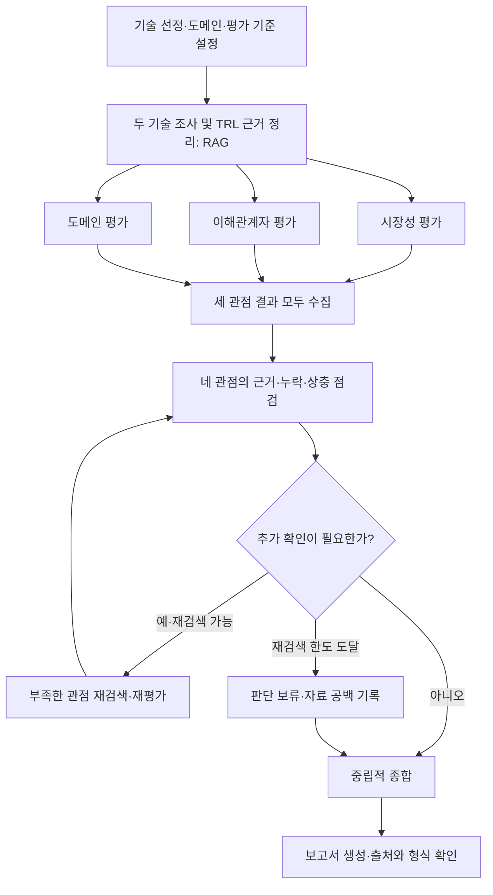

# KV-cache 실습 가이드 재검증 및 반영 기준

> 이 문서는 주제 확정 전의 가이드 검토 기록입니다. 이후 선정한 구현 대상은 **RDKV와 Photonic-CXL**이며, 현재 계약은 [시장조사 에이전트 설계](MARKET_AGENT_DESIGN.md)를 따릅니다. 아래 초기 후보 제안은 이력으로 보존합니다.

- 확인일: 2026-09-21 (Asia/Seoul)
- 기준: [KV cache 최적화 기술 평가 — 노션](https://actually-war-1ea.notion.site/KV-cache-3ba7f4c866938099b7a8fdaa1831c07e)
- 페이지 표시 갱신일: 2026-08-12. 기간: 1.5 DAYS.
- 상태: 가이드 내용 검토 완료. 이 문서는 요구사항과 설계 보완 기록이며, 구현·실험·제출 완료를 의미하지 않는다.
- 구분: **가이드 명시**는 원문의 조건, **예시**는 변경 가능한 참고안, **제안**은 우리 프로젝트에 적용할 방법이다. 인용 원문과 제안을 구분한다.

## 1. 검토 범위와 이전 답변의 누락

노션 본문 전체, 아래 8개 펼침 항목의 내용, 추가 속성 2개를 확인했다. 추가 속성 Quiz와 Remark는 비어 있었다.

| 확인한 펼침 항목 | 확인 내용 | 이전 제안에 보완할 부분 |
| --- | --- | --- |
| KV cache Optimization | 병목, SW/HW 접근, 병행 가능성, 소개 기술 | SW/HW 병행 가능성과 적용 조건을 평가에 포함 |
| Doc Pool | SW 3건, HW 3건, 각 진영에서 1건 선정 | 선택 방식과 선택 근거를 설계 문서에 고정 |
| TRL 9단계 구조 | 1~9단계 설명, NABIS 링크 | 단계별 근거와 적용 범위가 없었음 |
| TRL 공개 정보 기반 추정 | 초기·중간·후기 단계별 공개 정보 차이 | 정보가 없다는 이유로 낮은 단계로 단정하지 않도록 보완 |
| Graph(안) | 기술 선정 → 기술 조사 → 관점별 평가 → 종합 → 보고서 | 앞선 병렬 그래프에 기술 조사 결과를 공유하는 선행 단계 추가 |
| Reference Example | 특허·논문·웹 인용 예시 | 예시의 가짜 번호·생략 URL을 실제 출처로 사용하지 않도록 명시 |
| README Sample | 목적·기술·기능·스택·지표·역할·구조·실행법·기여자 | Hit Rate@K, MRR 및 생성/평가 모델 기록 보완 |
| 평가항목 | 설계 100점, 개발 100점 | 모든 항목과 결과 증거의 대응 관계 추가 |

NABIS의 연결 문서는 본문, 일반 단계 표, 산업별 표의 S/W 열, 분야별 정의 차이 주석까지 확인했다. 본문 내부의 목차·설계 항목 링크는 같은 노션 페이지의 앵커였다. 논문 6건은 후보 목록과 연결을 확인한 것이며, 이번 검토를 모든 논문의 본문·실험에 대한 전수 검증으로 해석하지 않는다.

**이전 답변은 아이디어와 실행 가능성에 집중했으며, 전체 가이드를 빠짐없이 설계에 반영한 상태는 아니었다.** TRL, 외부 관점의 세부 항목, README 예시, 출처 형식, 전체 제출 조건을 이 문서로 보완한다.

## 2. 실습 목적과 선택 조건

출처: 노션의 실습 목표, 주제, A. Agent 정의, B. 설계.

| ID | 가이드 명시 또는 예시 | 반영·확인 방법 |
| --- | --- | --- |
| G01 | LangGraph 기반 Multi Agent와 Agentic RAG 구현 | 역할별 코드와 실제 실행 경로가 설계도와 일치하는지 확인 |
| G02 | 외부 정보 검색·요약 도구 정의 | 도구 입력·출력, 출처·수집일, 실패 결과를 기록 |
| G03 | SW/HW에서 각각 1개, 총 2개 기술 선정 및 사유 명시 | 선택 기술, 선정 이유, 제외 후보와의 차이를 기록 |
| G04 | 기술 선택은 에이전트 또는 조원 직접 선택 중 선택 | 앞선 추천은 Human 방식의 후보안. 자동 선정 에이전트는 필수 아님 |
| G05 | 기술·시장·도메인처럼 RAG O로 표시된 역할 중 최소 1개에 RAG 적용 | 기술 조사에 논문 RAG 적용을 우선안으로 설정 |
| G06 | RAG 문서는 제시된 풀에서 선택, 총 200쪽 이내 | 문서별 ID·버전·원본 페이지 수·사용 범위·합계를 관리. 웹 검색 자료도 출처를 기록 |
| G07 | 오픈소스 임베딩 필수, 후보와 선택 이유 명시 | 후보별 검색 성능·언어·자원·처리 시간을 근거로 선택. 순위만으로 결정하지 않음 |
| G08 | 기술 성숙도·시장·이해관계자·도메인의 4관점 평가 | 두 기술 × 네 관점의 8칸을 모두 작성. 미확인도 명시적 결과로 표시 |
| G09 | 관점 간 상충 지점을 드러내고 중립성 유지 | 우승 기술·종합 순위 대신 각 관점의 판단, 근거, 조건, 상충을 제시 |
| G10 | Agent 정의 표는 설계 목적에 따라 변경 가능 | 아래 여섯 역할을 출발점으로 사용하되 불필요한 역할을 추가하지 않음 |

제시된 여섯 역할은 기술 조사(원문 확보·개요·범위·한계), 시장 평가(규모·채택·성장), 이해관계자 평가(경쟁사·개발자·투자 시각), 도메인 평가(환경별 적합성), 평가 종합(일치·불일치), 보고서 생성(결과 연결)이다. 표의 RAG O가 세 역할 모두의 RAG 구현 의무를 뜻하지 않는다.

### Doc Pool 전체 목록

| 구분 | 후보 | 원문 |
| --- | --- | --- |
| SW | TurboQuant: Online Vector Quantization with Near-optimal Distortion Rate | [2504.19874](https://arxiv.org/abs/2504.19874) |
| SW | DeepSeek-V2: A Strong, Economical, and Efficient Mixture-of-Experts Language Model | [2405.04434](https://arxiv.org/abs/2405.04434) |
| SW | KIVI: A Tuning-Free Asymmetric 2bit Quantization for KV Cache | [2402.02750](https://arxiv.org/abs/2402.02750) |
| HW | InfiniGen: Efficient Generative Inference of Large Language Models with Dynamic KV Cache Management | [2406.19707](https://arxiv.org/abs/2406.19707) |
| HW | ITME: Inference Tiered Memory Expansion with Disaggregated CXL-Hybrid Memories | [2606.12556](https://arxiv.org/abs/2606.12556) |
| HW | Scalable Processing-Near-Memory for 1M-Token LLM Inference: CXL-Enabled KV-Cache Management Beyond GPU Limits | [2511.00321](https://arxiv.org/abs/2511.00321) |

KVTC, CMX는 배경 설명에 등장하지만 위 6건의 Doc Pool에 포함된 논문은 아니다. 현재 우선안은 KIVI와 InfiniGen이며, 이는 실습 자료와 구현 가능성을 고려한 주제 제안이다. 보고서에서 KIVI나 InfiniGen 자체를 우월한 기술로 추천한다는 뜻이 아니다.

KIVI 15쪽과 InfiniGen 18쪽은 앞선 조사에서 PDF 페이지 수를 확인했다. 총 33쪽이며, 실제 적재 시 고정한 버전의 페이지 수를 다시 기록한다. 문서를 조각내는 chunk 수와 원본 페이지 수는 다르다. 제한에 대한 예외를 가정해 대량 웹 문서를 RAG 풀에 추가하지 않는다.

## 3. TRL: 9단계와 공개 정보의 한계

출처: [노션 C. 평가 관점 및 기준](https://actually-war-1ea.notion.site/KV-cache-3ba7f4c866938099b7a8fdaa1831c07e#3ba7f4c8669380468036d36c6d150119), [NABIS 기술성숙도/기술준비수준](https://nabis.go.kr/termsDetailView.do?menucd=189&gbnCode=S51&eventNo=192&ref=ai-ethics.kr).

TRL은 기술이 개발·검증·운용의 어느 단계에 도달했는지 판단하는 척도다. 높은 TRL만으로 성능이나 시장성의 우열을 결론내리지 않는다. 아래 가운데 열은 노션 설명의 요약이고, 마지막 열은 **KV-cache 평가를 위한 제안**이다.

| 단계 | 노션의 단계 의미 | 확인할 증거의 예시 — 우리 적용안 |
| --- | --- | --- |
| 1 | 기본 원리·이론을 관찰하는 수준 | 문제 원리, 이론적 근거 |
| 2 | 기술 개념과 적용 가능성을 정립 | 알고리즘·구조 제안, 활용 시나리오 |
| 3 | 실험실에서 개념의 작동을 검증 | 작은 실험이나 시뮬레이션으로 핵심 아이디어 확인 |
| 4 | 실험실에서 구성요소를 통합·검증 | 구현된 핵심 모듈과 통합 실험 결과 |
| 5 | 실제 환경과 유사한 조건에서 구성요소 검증 | 대상 모델·메모리·부하를 반영한 검증과 제한 |
| 6 | 실제 환경과 유사한 조건에서 시스템 시연 | 전체 추론 시스템을 연결한 시연, 목표 조건 충족 |
| 7 | 실제 운용 환경에서 시스템 시제품 시연 | 실사용 환경·고객 환경의 파일럿과 결과 |
| 8 | 시스템을 완성하고 양산 적합성 검증 | 배포·제품화에 필요한 검증과 운영 준비의 근거 |
| 9 | 상용 양산·납품을 포함한 실제 운용 | 상용 서비스·제품에서 지속 운용한 직접 근거 |

### 연결 문서를 읽고 추가한 주의점

NABIS는 분야마다 TRL의 세부 정의가 달라질 수 있다고 설명한다. 일반 산업용 표와 S/W 표도 동일한 표현을 사용하지 않는다. 예를 들어 S/W 표는 4를 연구 프로토타입, 5~6을 서브시스템 개발·검증, 7~8을 시스템 통합 및 실제 환경 검증으로 구분한다. 노션의 단계 설명을 수업 기준으로 사용하고, SW·시스템 기술에 어떤 증거를 대응시켰는지 별도로 설명한다. 이 적용안은 공식 인증이 아니다.

### 공개 정보 구간별 해석 — 노션에서 명시한 내용

| 구간 | 공개 정보의 성격 | 평가 시 반영 |
| --- | --- | --- |
| 1~3 | 논문·학회 발표·특허 등 연구 자료가 비교적 잘 공개됨 | 문서의 존재에 더해 실제 실험 내용을 확인 |
| 4~6 | 성능·공정·수율 등 비공개 정보로 공백이 커질 수 있음 | 공개 증거가 부족한 상황과 기술이 미성숙한 상황을 구분 |
| 7~9 | 고객 샘플·양산 발표·실적 공시 등이 일부 공개됨 | 제품·고객·적용 기술의 동일성과 운용 환경 확인 |

이 구간 구분은 공개 정보의 경향이다. 논문이라는 이유로 일괄 TRL 3을 부여하거나, 제품 발표만으로 TRL 9를 부여하는 규칙이 아니다. 논문 발표와 실제 채택 간 시차가 있으며, **공개 정보 기반 추정이라는 점을 반드시 표시**한다.

### TRL 결과에 보존할 항목 — 제안

- 평가 대상의 정확한 범위: 논문 알고리즘, 공개 구현, 상용 제품 중 무엇인가.
- 평가 기준일과 소스 버전.
- 확인한 실험·검증 환경과 직접 근거 ID.
- 추정 단계 또는 범위, 그 판단의 이유.
- 상위 단계로 판단할 근거 중 아직 없는 것.
- 반대 근거·자료 공백·정성적 확신 수준과 이유.

자료가 부족하면 단계 범위 또는 판단 보류로 남긴다. 자료에서 찾지 못했다는 사실을 실제 도입이 없다는 주장으로 바꾸지 않는다. KIVI·InfiniGen의 최종 TRL은 이번 가이드 감사만으로 확정하지 않는다.

## 4. 네 관점의 세부 평가 기준

가이드의 각 세부 항목을 모두 조사 범위에 포함한다. 아래 수치·자료 수집 방식은 구현 제안이며 원문의 추가 의무가 아니다.

| 관점 | 빠짐없이 조사할 항목 | 우리 판단 기준·자료 | 정보가 부족할 때 |
| --- | --- | --- | --- |
| 기술 성숙도 | TRL, 개발·검증·운용 단계 | 원문 실험, 구현, 운영 사례를 위 TRL 기준에 대응 | 공개 정보의 한계와 추정 범위 |
| 시장성 | 시장 규모·성장성, 상용화·실제 채택, 제품 출시, 지원 프레임워크·표준화 | 대상 시장·지역·연도·측정 단위, 제품의 기술 적용 관계, 공식 지원 문서 | 해당 기술의 시장 규모를 확인하지 못했음을 표시 |
| 이해관계자 | 경쟁사 반응·대응 기술, 도입 기업·개발자 의견과 장벽, 투자 동향·애널리스트·미디어 시각 | 누가 언제 어떤 역할에서 평가했는지, 직접 발언과 해석 구분 | 특정 집단의 시각을 확보하지 못했다고 표시 |
| 도메인 적용 | 선택한 환경에서의 적합성과 한계 | 모델·문맥 길이·동시 요청·메모리·지연·비용·품질 허용 범위 | 공개 실험 조건과 목표 조건의 차이를 명시 |

가이드는 데이터센터·클라우드, 온디바이스, 장문맥 애플리케이션을 예로 들고 특정 도메인의 선택을 허용한다. 세 도메인을 모두 구현할 필요는 없다. 설계 산출물에는 선택 도메인을 명시해야 한다. 현재 제안은 **장문맥 문서 QA를 제공하는 클라우드 서빙**이며, 요구 메모리·지연·품질·운영 장벽을 공통 기준으로 비교한다. 구체적 모델·부하 값은 실험 또는 근거를 확보한 뒤 정한다.

시장성·이해관계자 분석을 GitHub README와 Issues만으로 완료 처리하지 않는다. 넓은 AI 서버 시장의 성장률을 KIVI 자체 시장 성장률로 바꾸지 않는다. 연구팀의 주장, 독립 검증, 특정 사용자의 문제 제기, 평가자의 추론은 따로 표시한다. 투자 관점은 공개 자료 기반 관찰이며 투자 권고가 아니다.

### 종합 및 편향 방지 — 가이드 요구를 구현하는 제안

1. 두 기술에 같은 질문과 평가 항목을 적용한다.
2. 지지 근거와 제한·반대 근거를 모두 수집한다.
3. 두 기술 × 네 관점의 각 칸에 결론·출처·조건·미확인을 기록한다.
4. 서로 다른 기준선·GPU·모델·부하의 향상 배수를 직접 순위화하지 않는다.
5. 관점 간 일치, 실제 상충, 단순한 실험 조건 차이, 증거 부족을 구분한다.
6. 압축과 메모리 계층 확장의 병행 가능성도 검토한다. 실제 결합 효과는 별도 증거가 필요하다.
7. 최종 문장은 각 환경·관점에서의 의미를 설명하고 종합 우승자를 만들지 않는다.

## 5. 그래프와 State의 보완안

출처: [노션 D. 그래프 설계](https://actually-war-1ea.notion.site/KV-cache-3ba7f4c866938099b7a8fdaa1831c07e#3ba7f4c8669380938a72d3f18218f5ba).

노션의 그래프는 변경 가능한 예시다. 다만 **기술 조사에서 두 기술의 공통 사실을 확보한 뒤 시장·이해관계자·도메인 평가로 분기한다**는 의존관계가 있다. 이전 제안처럼 준비 단계 직후 기술 조사까지 함께 병렬화하면 평가 에이전트가 공유할 기술 사실이 부족할 수 있으므로 아래를 우선안으로 수정한다.



재검색 최대 2회는 **우리 제안**이다. 가이드가 지정한 숫자가 아니다. 재검색하면 근거만 추가하지 말고 영향을 받는 평가도 갱신한다. 병렬 노드에서 같은 State 키를 동시에 덮어쓰지 않도록 관점별 키를 분리한다. 공유 evidence 목록을 쓴다면 ID 기반 병합·중복 처리 규칙을 별도로 정의한다. 위 합류 지점은 실제 코드에서도 모든 분기의 완료를 기다려야 한다.

### 설계 문서에 포함할 State 표 — 초안

| 키 | 저장 내용 | 작성 주체·갱신 원칙 |
| --- | --- | --- |
| selection | 두 기술, SW/HW 분류, Human/Agent 방식, 선정 사유 | 시작 단계에서 확정 |
| scope | 선택 도메인, 질문, 평가 기준일, 조건 | 시작 단계, 이후 변경은 명시 |
| documents | 문서 ID·버전·URL·페이지 수·사용 범위 | 자료 준비 단계, 페이지 합계 검증 |
| technical | 기술별 개요·범위·원리·한계·실험 조건·TRL 근거 | 기술 조사 담당 |
| market | 규모·성장·채택·생태계와 근거 | 시장 평가 담당 |
| stakeholders | 경쟁 진영·도입자·개발자·투자 시각과 근거 | 이해관계자 평가 담당 |
| domain | 목표 환경별 적합성·제약·조건 차이와 근거 | 도메인 평가 담당 |
| coverage | 두 기술 × 네 관점의 충족·미확인 상태 | 종합 전 점검 |
| gaps | 추가 확인 질문, 이유, 담당 관점 | 점검 담당, 재평가 후 갱신 |
| attempts | 관점별 재검색 횟수와 종료 이유 | 흐름 제어 |
| conflicts | 서로 다른 관점의 일치·상충·조건 차이 | 종합 담당 |
| synthesis | 근거에 연결된 중립적 해석 | 종합 담당 |
| report | SUMMARY·본문·REFERENCE와 파일 경로 | 보고서 담당 |

각 관점 결과 내부에 evidence ID·출처 위치·날짜·직접 인용 또는 요약·추론 여부를 둔다. 증거 수집과 보고서 생성에서 사용하는 참조 ID를 일관되게 유지한다.

## 6. 보고서와 참고문헌

출처: [노션 E. 평가 보고서](https://actually-war-1ea.notion.site/KV-cache-3ba7f4c866938099b7a8fdaa1831c07e#3ba7f4c866938078829ac93c89c0710a).

가이드는 본문 목차를 자유롭게 정하도록 하지만 처음은 SUMMARY, 마지막은 REFERENCE로 지정한다. SUMMARY는 1/2쪽 이내로 평가 결과를 요약한다. 프로젝트 소개만으로 채우지 않는다.

반영할 목차안:

1. SUMMARY — 결과, 주요 상충, 자료의 한계 요약.
2. 분석 배경 — KV-cache 병목과 평가 목적.
3. 기술 선정 — 두 기술, 선정 방식·이유, 평가 도메인.
4. 기술 개요 — 핵심 접근, 범위, 조건, 한계.
5. 관점별 평가 — 기술 성숙도/TRL, 시장성, 이해관계자, 도메인 적용의 네 소절.
6. 시사점 — 관점 간 일치·상충, 적용 조건, 병행 가능성.
7. 한계점 — 공개 정보·실험 조건의 한계, 확증편향 방지 조치.
8. REFERENCE — 실제 인용·활용한 자료만 기재.

원문의 참고 목차에서 관점별 평가 예시가 시장·이해관계자·도메인을 나열하더라도 C절의 **TRL 관점은 빠지면 안 된다**. 이 문서에서는 네 소절로 명시했다.

| 자료 종류 | 가이드가 제시한 표기 요소 | 적용 시 주의 |
| --- | --- | --- |
| 특허 | 출원인, 연월, 명칭, 특허/공개 번호, URL | 실제 번호·권리 주체 확인 |
| 논문 | 저자, 연도, 제목, 학회/학술지, 권·호·쪽 | arXiv만 확인된 자료의 학회·권·쪽을 꾸며내지 않고 arXiv ID·버전을 기록 |
| 웹 | 기관/작성자, 발행일, 제목, 사이트, URL | 날짜가 없으면 미표기 사실을 남기고 확인일을 별도 기록 |

노션의 Reference Example에 있는 `US-XXXXXXX-A1`, `2504.xxxxx`, `https://...`는 형식 예시의 자리표시자다. 해당 특허·문헌의 존재를 검증한 참고문헌으로 취급하지 않는다. 본문 참조와 참고문헌 목록이 양방향으로 맞는지 확인한다.

## 7. README와 검색 평가

README Sample은 참고 구조다. 아래 요소를 실제 프로젝트에 맞게 채운다.

| 항목 | 반영할 내용 |
| --- | --- |
| Subject / Overview | 목적, 대상 도메인, Multi Agent·Agentic RAG 방식, 사용 도구 |
| Selected Technologies | SW/HW 기술명과 선택 이유 |
| Features | 문서 추출·분석 기능, 확증편향 방지 전략 |
| Tech Stack | LangGraph, 생성 모델, 평가 모델을 썼다면 그 모델, 검색 저장소, 임베딩 |
| Retrieval 지표 | Hit Rate@K, MRR와 평가 조건·데이터 |
| Agents | 역할별 입력·책임·출력과 RAG 적용 여부 |
| Architecture | 실제 구현과 일치하는 그래프 이미지 |
| Directory Structure | data·agents·prompts·outputs·실행 진입점 등의 위치 |
| Usage | 필요한 환경, 설치·설정·자료 준비·실행 방법과 결과 위치 |
| Contributors | 개인별 실제 수행 업무. PM·PL 직함으로 대체하지 않음 |

예시에 Generator와 Judge가 나뉘어 있지만 별도 유료 모델 2개가 필수라는 뜻은 아니다. 검증 방식을 설계하고 실제 사용한 모델·규칙을 기록한다. 샘플의 파일명·디렉터리명도 참고안이며, 실행법은 실제 구조에 맞아야 한다.

검색 지표는 샘플에 등장하는 중요한 참고 요소로 포함한다. 별도 의무 성능 임계값은 페이지에 없다.

- **Hit Rate@K**: 평가 질문 중 상위 K개 검색 결과에 정답 근거가 하나 이상 포함된 질문의 비율.
- **MRR**: 질문별 첫 정답 근거의 순위 역수 평균. K개까지만 평가하면 MRR@K라고 적고, 그 안에 정답이 없을 때 0으로 처리한다.
- 다중 근거 질문은 위 지표만으로 충분하지 않으므로 필요한 근거를 모두 찾았는지도 별도 확인한다.
- 질문, 정답 근거 문서·페이지, 모델·분할·K·검색 방식·평가 표본 수를 기록한다.
- 후보 비교용 질문과 최종 확인용 질문을 구분한다. 20~30문항은 앞선 제안이며 가이드의 지정 수량은 아니다.
- BGE-M3의 짧은 문장 임베딩 실행 성공은 모델 로드·호출 확인이다. 논문 검색 Hit Rate·MRR 측정으로 보고하지 않는다.

## 8. 제출물·발표·최종 확인

출처: [노션 Deliverables](https://actually-war-1ea.notion.site/KV-cache-3ba7f4c866938099b7a8fdaa1831c07e#3ba7f4c866938042a7dfdfb9624d1507), Final Reminders.

| 구분 | 포함해야 하는 내용 | 기한·방식 |
| --- | --- | --- |
| 설계 PDF | 기술 2건·사유, 선정 방식, RAG 적용 대상, 임베딩 선택, 특정 도메인, 네 관점 기준, State 표, Mermaid, 보고서 목차 | DAY 3 10:00, 반별 Slack 스레드 |
| 개발 산출물 | GitHub 링크, 실제 구현, README, 개인별 기여 업무 | DAY 3 16:00, 반별 Slack 스레드 |
| 평가 보고서 PDF | 설계한 구조에 따른 평가 결과, SUMMARY, REFERENCE | DAY 3 16:00, Git 링크와 PDF 제출 |
| 발표 | README로 10분, 설계·개발 차별점, 보고서 핵심, Lessons Learned | 개발 산출물 제출 마감 후 |

파일명은 원문 형식을 따른다. 캠퍼스 후보는 광주·울산·판교다.

```text
RAG-Design_{캠퍼스}-{X반}_{이름1+이름2+이름3+이름4+이름5+이름6}.pdf
RAG-Output_{캠퍼스}_{X반}_{이름1+이름2+이름3+이름4+이름5+이름6}.pdf
```

실제 캠퍼스·반·조원 이름은 아직 확정 입력하지 않았다. DAY 3를 임의의 달력 날짜로 변환하지 않는다. AI 도구 사용이 허용되더라도 가이드와의 일치 및 코드 재현성을 확인해야 한다. 이번 작업은 제출 기준을 정리한 것이며 Slack 전송·GitHub 게시를 수행한 것은 아니다.

## 9. 전체 평가표와 확인 증거

### 설계 산출물 — 합계 100점

| 평가항목 | 점수 | 확인할 증거 |
| --- | ---: | --- |
| 문제 정의 | 5 | 선택 도메인의 문제와 조건이 구체적인가 |
| Agent 설계 | 15 | 책임이 구분되고 불필요한 Agent가 없는가 |
| RAG 설계 | 15 | 적용 역할, 문서 선택, 활용 방식이 타당한가 |
| Embedding 모델 선택 | 10 | 오픈소스 후보·선정 이유·적용 전략이 있는가 |
| 평가 기준 설계 | 15 | 네 관점의 대상과 기준이 정해져 있는가 |
| State Schema 설계 | 15 | 데이터 흐름·작성 주체·병렬 갱신이 고려되어 있는가 |
| Graph 설계 | 15 | 흐름·분기·반복과 협업 구조가 논리적인가 |
| 보고서 구조 설계 | 10 | 목적과 결과 전달에 맞는 목차인가 |

### 개발 산출물 — 합계 100점

| 평가항목 | 점수 | 확인할 증거 |
| --- | ---: | --- |
| 설계 구현 충실도 | 15 | Agent·Graph·State가 제출 설계와 일치하는가 |
| Agent 구현 | 15 | 역할 분리와 실행 흐름이 실제로 동작하는가 |
| RAG Pipeline 구현 | 20 | 문서 로딩→임베딩→검색→컨텍스트 활용이 연결되는가 |
| 코드 구조·프로젝트 구성 | 10 | 디렉터리·모듈·실행 진입점이 명확한가 |
| 실행 결과 재현성 | 10 | 문서화된 실행으로 실제 보고서가 생성되는가 |
| Output — 보고서 | 20 | 생성 결과가 설계와 중립적 평가 목적에 맞는가 |
| Output — README | 10 | 목적·구조·실행법이 명확하고 간결한가 |

가이드를 읽은 것은 위 점수를 충족했다는 증거가 아니다. 실제 설계·코드·평가 결과·출력 파일로 각각 검증해야 한다.

## 10. 기술 설명을 인용할 때 별도로 확인할 사항

과제의 제출·평가 요구사항은 노션을 기준으로 삼고, 기술 성능 수치는 원문과 실험 조건으로 확인한다.

| 항목 | 확인된 차이·주의점 | 반영 방법 |
| --- | --- | --- |
| ITME 성능 | 노션의 1.80배 소개와 현재 v2 초록의 최대 35.7% 처리량 향상이 다름 | [원문](https://arxiv.org/abs/2606.12556)의 버전·기준선·실험을 확인. 현재 단계에서 차이의 원인을 단정하지 않음 |
| TurboQuant 비트 수 | 노션은 3비트로 소개하고, 연결 논문 초록은 3.5 bits/channel의 품질 유지와 2.5에서의 작은 저하를 설명 | [원문](https://arxiv.org/abs/2504.19874)의 설정·비트 계산·평가 조건 기록 |
| DeepSeek-V2의 93.3% | 소개 숫자를 모든 모델 대비 보편적인 감소율로 사용하면 안 됨 | [논문](https://arxiv.org/abs/2405.04434)의 DeepSeek 67B 비교 조건 명시 |
| KIVI 날짜 | 노션의 2024-06-25 표기와 arXiv v2의 2024-07-25가 일치하지 않음 | [서지 정보](https://arxiv.org/abs/2402.02750)의 버전·학회 정보로 참고문헌 작성 |
| HW 접근과 정확도 | 외부 메모리 활용 전반의 소개를 모든 선택적 KV 관리 기술에 무손실 보장으로 적용할 수 없음 | InfiniGen의 선택적 프리패치와 품질 측정 조건을 별도로 평가 |
| 후속 구현과 실제 채택 | 영감을 받은 구현과 원본 기술을 그대로 채택한 구현은 동일하지 않음 | 기술·구현 버전·공식 지원·실제 운영 사례를 따로 확인 |

## 11. 앞으로 적용할 완료 기준

이번에 완료한 것:

- [x] 노션 본문과 8개 펼침 항목 확인.
- [x] 추가 속성 2개에 누락 자료가 없는지 확인.
- [x] NABIS의 일반·S/W TRL 설명과 정의 차이 확인.
- [x] 기존 제안의 누락 및 수정 사항을 문서에 반영.
- [x] 네 관점, State, Graph, 보고서, README, 제출물, 전체 배점을 연결.

구현·평가 단계에서 완료해야 할 것:

- [ ] 주제·Human/Agent 선정 방식·도메인을 확정하고 설계 PDF 작성.
- [ ] TRL 단계 적용 기준을 고정하고 두 기술의 근거 및 자료 공백 조사.
- [ ] 시장 규모·성장·채택·생태계와 이해관계자 세 집단을 모두 조사.
- [ ] 두 기술 × 네 관점의 근거 또는 미확인 이유 확보.
- [ ] 문서 버전·페이지 합계·출처 목록 기록 및 논문 RAG 실행.
- [ ] 임베딩 후보 비교와 Hit Rate@K·MRR 측정.
- [ ] 기술 조사 선행, 분기 합류, 재검색 종료, State 갱신 동작 확인.
- [ ] 조건·출처·상충·편향 방지 조치를 포함한 보고서 생성.
- [ ] SUMMARY 분량, 참고문헌 대응, PDF 표시 확인.
- [ ] 실제 실행법·역할·모델·구조·지표가 담긴 README 작성.
- [ ] 새 실행에서 보고서가 생성되는지 재현 확인.
- [ ] 제출 파일명·조원 정보·발표 분량 확인.

**현재 판단:** 가이드 검토의 누락은 위 범위에서 보완했다. 프로젝트가 모든 평가 기준을 충족하는지는 구현과 실행 증거로 다음 단계에서 확인해야 한다.
