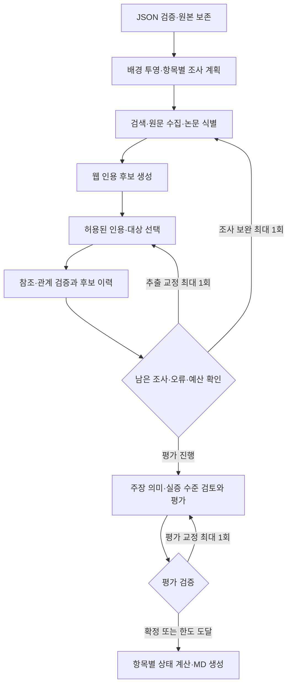

# JSON 시장조사 실행 원인 분석 및 수정 설계 v1.2

- 작성일: 2026-09-22
- 상태: **구현 반영. 실제 입력을 4파일 technical bundle로 확장하고 라이브 실행·원문 대조·로컬 재검증 완료.**
- 기준 코드: `d5d70d99dc6e56a8289573c5a7e98260d998794a`
- 분석 대상: `market_agent/outputs/20260922_json_live/market_handoff.md`
- 내부 증거: `.cache/298cf99e44cdb8241c93f0f77018b1a090ab85afe8a6a72010baa4bbc2bd0358/{run,debug}.json`
- 범위: JSON 입력을 사용하는 시장조사 에이전트의 근거 처리·조사 제어·전달 상태 개선. 아래 증거는 해당 실행의 관찰이며 최신 시장 현황을 재조사한 결과가 아니다.

## 1. 목표와 유지할 계약

기술 조사 JSON을 배경으로 시장 자료를 수집하고, **각 결론이 어떤 자료를 어떤 범위에서 사용했는지 설명 가능한 시장성 MD**를 만든다.

- 입력: paper_analysis 1.1.0 한 개 또는 두 개. 기존 MD 입력도 유지한다.
- 출력: 기술당 기존 시장성 6개 항목과 실제 인용을 담은 `market_handoff.md` 한 개.
- 기본 상한: 재시도를 포함해 검색 6 / 원문 추출 10 / LLM 5시도. 더 작은 사용자·부모 한도를 우선한다.
- 원본 JSON, 기존 결과, 상위 근거 ID는 보존한다. 입력 파일 수정이나 전체 논문 재분석을 요구하지 않는다.
- 자료를 조사했으나 입증하지 못한 경우 unknown은 정상 결과다. 처리 실패, 조사 미실시, 관련 기술군만 확인한 경우를 구별한다.
- 2~5절은 최초 원인 분석·설계 당시 기록이다. 구현 및 실제 재검증의 변경점은 마지막 절과 LIVE_VALIDATION.md에 기록한다. 모델은 gpt-4.1-mini를 유지한다.

## 2. 실제 실행에서 확인한 사실

| 관찰 | 확인 결과 |
| --- | --- |
| 입력 | RDKV·Photonic-CXL JSON 두 개, 상위 근거 25개 |
| API | 기록된 11시도 모두 `ok`; 인증·전송 오류 없음 |
| 사용량 | 검색 2 / 원문 6 / LLM 3, 총 31,796토큰 |
| 남은 한도 | 검색 4 / 원문 4 / LLM 2 |
| 확보 자료 | 본문 품질 검사를 통과한 웹 자료 5개, 인용 후보 35개 |
| 최초 모델 추출 | 주장 21개 → 현재 검증기로 재생하면 5개 통과, 잘못된 인용 ID 9개·대상 동일성 오류 7개 |
| 보완 추출 | 주장 11개 → 5개 통과, 잘못된 인용 ID 6개 |
| 최종 오류 | 인용 ID 오류 6개 + 출처 검토 상태 불일치 1개 |
| 최종 전달 | 조건부 1 / 미확인 11, 관련 기술군 정보 0, 인용 출처 1개 |
| 실행 경로 | collect → extract → repair_extract → extract → compose → finish |

검증 방법: 저장된 `SelectedExtraction`을 현재 `resolve_quotes`와 `validate_claims`에 다시 넣었다. API를 다시 호출하지 않은 결정적 재현이다. 이는 모델이 다음 호출에서도 같은 응답을 낸다는 뜻은 아니다.

## 3. 원인과 발생 위치

### A. 배경 근거 ID와 웹 인용 ID를 프롬프트 설명만으로 구분한다 — P0

- `json_input.py:70–90`은 기술 요약에 `ev-...` 근거 ID를 포함한다.
- `providers.py:50–68`은 이 요약과 웹 인용 후보를 동일 추출 호출에 전달한다.
- `schemas.py:178–192`의 `quote_id`는 자유 문자열이다. strict 구조화 출력도 등록 ID의 구성원인지 검사하지 않는다.
- 최초 응답의 잘못된 ID 9개는 모두 실제 상위 `ev-...`였다. 보완 응답의 잘못된 ID 6개는 상위 ID의 접두사만 `Q-`로 바꾼 값이었다.
- 현재 프롬프트에는 이미 상위 ID 사용 금지 문구가 있다. 설명을 더 강하게 쓰는 것만으로는 재발을 막기 어렵다.

**수정:** 원본 저장과 모델용 배경 투영을 분리하고, 웹 인용은 실제 후보 집합에서만 선택하도록 계약을 제한한다. 접두사 교체·유사 ID 매칭으로 자동 연결하지 않는다.

### B. 다른 제품의 유효한 원문을 선정 논문과 동일하다고 분류한다 — P0

- 최초 응답은 Marvell 제품 관련 7개 주장을 모두 `exact`로 제출했다. 웹 인용 자체는 등록된 후보였지만 Photonic-CXL 논문과 동일성은 입증되지 않아 제외됐다.
- 이는 동일성 검사가 필요한 사례다. 검사를 완화하면 제품 발표가 논문 상용화로 바뀐다.
- 해당 후보는 다음 보완에서 사라졌고, 최초 제외 이유도 최종 오류 목록에서 교체됐다. 마지막 보고서만으로는 소실 경로를 알기 어렵다.
- 7개 중 6개는 모델이 만든 제품명 문자열이 원문과 정확히 일치하지 않았다. 관계만 바꾸면 `subject_unverified`로 다시 제외될 수 있다.
- 최초 후보 하나를 `method_family`와 동일성 미확인 조건으로 바꾼 메모리상 재현은 현재 구조 검사를 통과했다. **의미 검증이나 실제 채택 확정을 뜻하지 않으며, 산출물은 수정하지 않았다.**

**수정:** 인용의 유효성, 대상 명칭, 선정 논문과의 관계를 독립적으로 평가한다. 원문 대상 표현을 선택하게 하고, 동일성 미확인 후보를 관련 자료로 재검토하는 경로를 둔다. 모든 exact 실패를 자동으로 관련 자료로 승격하지 않는다.

### C. 오류 복구와 추가 조사가 보완 기회 하나를 경쟁한다 — P0

- `node.py:107–119,165–168`은 `repair_used` 한 개로 추출 교정·추가 수집·평가 교정을 모두 제어한다.
- 이번 실행은 추출 교정이 이 기회를 사용했다. 오류가 남고 호출 한도가 남아도 추가 수집으로 갈 수 없었다.
- `search_plan.py:15–23`의 초기 질의는 기술당 하나, 주로 제품화·채택·생태계다.
- 시장 규모·표준화의 네 칸은 실제 검색이 없었다. `repair_questions`도 회차당 기술별 한 질문만 고르므로, 오류가 없더라도 기존 방식으로 12개 항목 전체를 조사했다고 보기 어렵다.

**수정:** 추가 조사 1회, 추출 교정 1회, 평가 교정 1회를 서로 구분하되 전체 호출 한도로 통제한다. 마지막 평가에 필요한 LLM 1시도를 예약한다. 미조사 항목을 우선하는 조사표를 사용한다.

### D. 출처 하나의 오류가 11개 미확인 행 전체에 퍼진다 — P0

- `node.py:93–96`의 `source_review_mismatch`는 출처 ID만 있고 영향 기술·항목이 없다.
- `research.py:35`는 누락된 기술·항목을 현재 행으로 대체해 모든 행과 일치시킨다.
- 동일한 저장 결과에서 이 전역 오류 하나만 제거하고 `annotate`를 재생하면 처리 오류 표시가 11행에서 HW 고객 가치 1행으로 줄었다. 다른 자료·판정은 변경하지 않았다.
- `research.py:29–30`은 검토된 자료를 사실상 최종 통과 주장으로 집계한다. 검토 후 기각한 HW 고객 가치는 `not_started`로 표시됐다.

**수정:** 오류 영향 범위를 명시하고, 실제 자료 검토 이력과 최종 채택 근거를 따로 기록한다. 출처 단위 검토 요약은 유효·기각 후보 기록으로 코드가 계산한다.

### E. 인용 일치 검증으로 주장 성격까지 보증하지 못한다 — P1

- 최종 RDKV 환경·탄소 효과는 논문 저자의 설명이다. 고객 환경에서 측정한 비용·에너지 절감이 아니다.
- `quotes.py:63–66`의 가능성 표현 검사는 could/may/might 등 일부 단어에 의존한다. 단정형 문장으로 서술된 전망은 잡지 못한다.
- `quote_bank`의 context가 text와 같아 주변 조건과 절의 목적을 충분히 전달하지 않는다.
- 추출 프롬프트의 전체 12개·항목당 2개 제한은 코드로 강제하지 않는다. 최초 응답은 21개, 한 항목에는 최대 10개였다.
- 평가 모델은 남은 SW 5개 주장을 모두 supported로 판단했다. 문장 일치 외에 시장 관련성·실증 수준·범위 확인이 필요하다.

**수정:** 원문 주변 문단·절 제목·조건을 보존하고, 실제 관측·발행자 주장·계획·추론을 별도 분류한다. 전체 후보량과 항목별 배분은 코드로 제한한다.

### F. 입력의 논문 식별 정보가 조사 시작에 충분히 활용되지 않는다 — P1

- HW 입력에는 공개 논문 URL이 없다. 로컬 `source_path`를 임의로 읽지 않은 처리는 유지해야 한다.
- 현재 검색은 짧은 기술명 `Photonic-CXL` 위주다. 원문 `paper.title`을 논문 식별용으로 활용할 필요가 있다.
- SW는 arXiv ID는 있지만 버전이 없어, 조회 본문과 상위 분석의 버전 일치는 아직 보장되지 않는다.
- 본문 조회 시 발행일을 추출하지 않아 저자·버전·공개일 확인도 부족하다. 모델이나 실행일로 날짜를 채우면 안 된다.

**수정:** 전체 제목·알려진 식별자·제공된 저자를 이용해 동일 논문 후보를 찾고 확인한다. 실패 시 식별 미확인을 유지하고 관련 시장 조사는 계속한다. 별도 무제한 검색은 추가하지 않는다.

## 4. 제안 구조



새 에이전트를 여러 개 추가하지 않는다. 기존 LangGraph와 두 LLM 역할을 유지하고, 상태·계약·분기 규칙을 고친다. 그래프 분기는 호출 상한과 단계별 방문 횟수로 종료를 보장한다.

### 4.1 입력 배경과 인용 계약

| 데이터 | 내부 보관 | 모델에 전달 | 시장 근거 사용 |
| --- | --- | --- | --- |
| 원본 JSON·상위 근거 ID | 원형 보존 | 원본 전체 전달 안 함 | 자동 승격 금지 |
| 기술 설명·적용 범위·한계 | 구조화 보존 | 간결한 배경 항목 | 검색·조건 판단에 사용 |
| 웹에서 확인한 구절 | 출처·원문·위치·해시 | 등록 인용 선택지 | 검증 후 사용 |
| 입력 발췌의 기술적 전제 | 상위 출처로 추적 | 필요한 조건 설명에만 사용 | 고객 가치 추론의 전제라는 성격 유지; 제품화·매출·채택 입증에 사용 불가 |

- 배경 투영은 문자열에서 ID만 정규식으로 지우기보다 JSON의 text/claim_type/confidence/limitations를 명시적으로 선택한다. 상위 confidence를 시장 신뢰도로 변환하지 않는다.
- 호출마다 실제 인용 후보 ID만 허용하는 enum 계약과 애플리케이션 검사를 함께 둔다. 제공자 스키마 지원 여부는 설치된 SDK로 검사한다. ID 형식 정규식만 검사하는 대체는 허용하지 않는다.
- 구절 후보가 없으면 추출 LLM을 호출하지 않는다. 모델 오류나 미등록 ID는 해당 후보만 격리하고 이전 통과 후보를 보존한다.
- 검색 ID, 상위 ID, 웹 인용 ID의 이름을 분리한다. 저장된 실제 연결표가 유일한 참조 기준이다.
- 후보 한도는 검증·중복 제거 후 전체 12개, 기술·항목당 2개로 결정적으로 적용한다. 관련 자료와 직접 근거가 경쟁하면 서로의 근거 유형을 고려한다. 제외 후보와 이유는 내부에 보존한다.
- 전체 한도에 도달하면 기술·항목별로 한 후보씩 배분한 뒤 두 번째 후보를 채운다. 모델의 반환 순서 때문에 한 기술의 고객 가치가 후보 풀을 독점하지 않게 한다.

### 4.2 대상·관계·주장 수준

- `exact`: 선정 논문·공식 구현과 대상 연결이 확인된 주장. 논문명을 잠깐 언급했다는 이유만으로 문서 전체를 exact로 보지 않는다.
- `method_family`: 같은 방법군 제품·연구의 주장. 선정 논문 제품화와 동일시하지 않는다.
- `adjacent`: 인접 시장·기반 인프라 자료. 해당 시장 규모를 선정 기술 매출로 대입하지 않는다.
- `subject_span`은 인용 또는 주변 원문의 실제 표현을 선택한다. 원문 이름과 정규화된 표시명·별칭의 연결은 별도 기록한다. 임의 이름 합성이나 모호한 부분 문자열로 통과시키지 않는다.
- 인용은 맞지만 exact 연결이 실패한 후보는 `needs_relation_review`로 남긴다. 같은 자료의 원문 대상을 확인하고 방법군 관련성을 검토한 뒤에만 보조 정보로 보존한다.
- 의미 검토는 인용 지지 여부, 시장 항목 관련성, 대상 관계, 조건 보존, `evidence_level`을 각각 판정한다. `supported=true` 한 개로 모두 대체하지 않는다.
- `evidence_level` 예: 연구 실험, 시뮬레이션, 발행자 설명, 출시 계획, 실제 고객 사례, 분석 추론. 이것과 verdict·basis는 다른 축이다.
- 출시 예정은 출시 완료가 아니다. 모델 벤치마크 사용은 고객 채택이 아니다. 메모리 절감이 실제 비용·에너지·탄소 절감을 측정했다는 뜻도 아니다.
- 근거가 허용하는 범위로 문장을 좁히거나 기각한다. 교정 문장도 같은 원문·조건·수치 검사를 거쳐야 한다. 고객 가치 추론에는 워크로드·적용 비용·미확인 고객 실적을 조건으로 남긴다.
- 한 행에서 사실과 추론을 함께 쓰면 전체를 fact로 승격하지 않는다. 최종 basis는 inference를 반영하고 각 인용의 성격을 보존한다. 표준을 못 찾았다는 이유만으로 not_applicable을 선택하지 않는다.

### 4.3 조사 계획과 한도

12개 행마다 `planned_queries`, 시도·결과, 원문 접근·검토 결과를 기록한다. 기본적으로 기술당 다음 세 목적을 배분한다.

| 목적 | 주요 대상 | 검색 방향 |
| --- | --- | --- |
| 선정 기술 확인 | 제품화·채택 | 전체 논문 제목, 공식 구현·라이선스·고객 사례 |
| 방법군 시장 | 시장 규모·고객 가치 | 추론 최적화 또는 CXL 메모리 풀링의 시장 정의·지역·연도·비용 조건 |
| 생태계와 표준 | 생태계·표준화 | 공식 지원 버전·구현 제약·표준 문서 및 선정 기술과의 연결 |

- 초기 최대 2질의로 양 기술을 확인한다. 보완 수집에서는 미조사 목적부터 최대 4질의를 선택한다. 기존 회차당 2질의 제한을 조정하는 제안이다.
- 각 질의의 대상 항목을 명시해도 그 항목의 원문 검토가 완료됐다고 표시하지 않는다. 재시도가 있으면 실제로 실행 가능한 신규 질의 수는 줄어든다.
- 후보 검색 결과의 범위 내에서 관련성·직접성으로 정렬한 뒤 선택한다. 원문 추출 한도, 중복 URL, 기존 확인 자료 재사용을 함께 적용한다.
- 원문 초기 6 / 보완 최대 잔여 4의 기본 배분을 활용한다. 본문이 확보된 같은 문서에서 목적별 구절을 다시 고르는 작업은 새 원문 호출 없이 처리한다.
- 정상 경로는 추출 → 추가 조사 후 추출 → 평가의 LLM 3시도를 목표로 한다. 추출 교정·평가 교정과 전송 재시도는 남은 2시도 안에서만 수행한다. 모든 경로에 마지막 평가 1시도를 예약한다.
- 예약량은 분기 판단뿐 아니라 실제 `Budget.call`의 `max_attempts`에도 반영한다. 추출 호출의 내부 재시도가 마지막 평가용 한도를 소비하지 않게 한다.
- 같은 오류를 같은 입력으로 반복하지 않는다. 교정에는 거부 후보 ID·실패 이유·허용 대상·관련 인용만 보내고 유효 후보는 다시 생성하지 않는다. 추가 자료가 준비됐다면 교정과 새 추출을 한 호출에 합친다.
- 부모가 보완을 관리하면 `auto_repair=False`와 공유 Budget을 계속 지원한다. 회차 간 카운터·후보 이력도 유지해 호출 한도 초기화를 막는다.

### 4.4 오류·조사 상태·결과의 분리

| 내부 기록 | 필요한 정보 | 목적 |
| --- | --- | --- |
| 후보 기록 | 최초 ID, 출처, 기술·항목, 검증/기각/교정 이력 | 재시도에서 자료가 조용히 사라지지 않음 |
| 자료 검토 | 출처×기술×항목, examined 범위, adopted/rejected/no_relevant_claim | 검토했지만 쓸 근거가 없는 상태를 기록 |
| 오류 | code, scope, affected_cells, 후보/출처 ID, active/resolved | 원인에 맞는 보완과 영향 범위 표시 |
| 실행 상태 | completed/partial/failed | 시스템 처리 결과 |
| 항목 판정 | 기존 5종 verdict와 직접/관련 근거 | 기술에 대한 평가 |

- 기술·항목 없는 오류를 모든 행으로 확장하지 않는다. 출처 연결로 영향 범위를 계산하고, 범위를 알 수 없으면 내부 실행 경고로 남긴다. 실제 전역 장애만 명시적으로 전역 범위를 사용한다.
- `source_review_mismatch`의 원인이 된 출처별 claims_extracted 여부는 후보와 검증 결과에서 계산한다. 모델은 항목별 검토 이유를 제공하고 코드는 일관성을 확인한다.
- 검토 여부는 실제로 살펴본 후보/구절에 근거한다. 채택 근거가 없어도 reviewed일 수 있다. 기술 요약만 읽은 것은 웹 조사 완료가 아니다.
- `not_searched`, 접근 실패, 검토 후 근거 부족, 동일성 미확인, 처리 실패, 한도 때문에 생략한 조사를 서로 구분한다.
- 일반적인 근거 부족만 있으면 실행 completed일 수 있다. 처리 실패·필수 조사 미완료가 남으면 partial로 표시하고 유효 행은 보존한다.
- 내부 결과 계약을 0.4로 올리고 부모 어댑터·캐시·CLI를 함께 갱신한다. 기존 status 필드는 호환 매핑을 명시하고 신규 `execution_status`를 별도로 둔다. MD 항목과 열은 유지한다.
- CLI는 정상 조사 완료 0, 치명적 실행 실패 2, 부분 처리/미완료 3을 제안한다. 호출자가 0만 성공으로 보는지 테스트하고 사용 문서에 변경을 명시한다. 의미 검토는 자동 검사이므로 'completed'가 독립 사실 검증을 보증하지 않는다.
- 통합용 MD에는 각 행의 해석에 필요한 한계만 짧게 넣는다. 상세 오류·토큰·검색어는 계속 내부 캐시에 둔다.

## 5. 구현 순서와 검증 관문

구체 작업 목록은 [tasks/todo.md의 J1~J8](../tasks/todo.md)을 따른다. 기존 완료 체크는 당시 범위의 기록이며 아래 수정의 완료를 뜻하지 않는다.

1. **J1~J3:** 재현 사례 고정 → 인용 선택 계약 → 대상·관련 자료 보존. 처음부터 상용화 오판을 만들지 않는 경계를 확인한다.
2. **J4~J5:** 오류 범위·검토 상태 → 조사 계획·예산 라우팅. 오류 교정 후에도 미조사 항목을 확인할 수 있게 한다.
3. **J6~J8:** 의미 검토·주장 수준 → 전달 계약·캐시 → 실제 JSON 동일 조건 검증.

### 합격 기준

- 상위 ID, 접두사만 바꾼 ID, 존재하지 않는 ID로 만들어진 시장 인용이 최종 전달에 0건.
- 원문이 유효하지만 선정 기술과 연결되지 않은 관련 제품 사례는 조건과 출처를 갖춰 보조 정보로 보존. 선정 논문 채택으로 승격 0건.
- 국소 오류를 다른 기술·항목의 오류로 표시하는 사례 0건. 검토 후 기각과 조사 미실시를 구별.
- 모델 응답의 후보 수 제한, 논문 1개/2개 행 수, 기존 MD 호환과 부모 예산·후속 호출을 검증.
- 남은 한도 안에서 예정한 조사 목적을 시도하거나 구체적인 생략 이유를 기록. 오류 복구만으로 검색 기회를 소진시키지 않음.
- 6/10/5 및 축소·0 한도, 429·시간 초과·재시도·후속 호출에서도 상한 초과 0건.
- RDKV의 고객 비용·환경 효과를 실측 성과로 쓰지 않음. 출시 계획과 출시 완료, 벤치마크와 고객 채택 구분.
- 실제 보고서의 모든 긍정·조건부 주장과 보조 정보에 대해 인용, 대상, 시점, 조건을 원문 대조.
- unknown 수 감소는 합격 기준이 아니다. 마지막 자동 결과와 수동 검토 의견을 구분하고 자동 보고서를 덮어쓰지 않는다.

### 검증 명령

`market-research-agent` 디렉터리에서 실행한다. API 호출은 마지막 라이브 비교 단계만 해당한다.

```bash
.venv/bin/python -m unittest discover -s market_agent/tests -v
.venv/bin/python -m compileall -q market_agent
.venv/bin/python -m market_agent.cli --input market_agent/fixtures/paper_analysis_sw.json market_agent/fixtures/paper_analysis_hw.json --mode fixture --as-of 2026-09-22 --output /tmp/market-json-v12-fixture
.venv/bin/python -m market_agent.cli --input /Users/jounghwoiryun/Downloads/paper_analysis-97345433eec88e62.json /Users/jounghwoiryun/Downloads/paper_analysis-6afac60cbf4a8cc0.json --mode live --debug --as-of 2026-09-22 --search-limit 6 --extract-limit 10 --llm-limit 5 --output market_agent/outputs/20260922_json_v12_live
```

각 출력 폴더는 최초 실행에만 사용하며 재실행 시 새 경로를 지정한다. 실제 첨부·캐시·원문·키를 테스트 저장소에 커밋하지 않고, 실패 형태를 재현하는 짧은 합성 자료를 사용한다.

## 6. 구현 경계와 남는 한계

- Always: 주장 단위 실패 격리, 원문 연결 검사, 최소 변경, 기존 통과 근거 보존, 변경된 테스트·설계·사용법 동기화.
- 별도 결정이 필요한 확대: 모델 교체, 호출 상한 증액, 새 의존성, 상위 입력 스키마 변경, 부모 전체 Graph 수정. 현재 제안은 이를 전제로 하지 않는다.
- Never: 근거 없는 수치 생성, 상위 confidence를 시장 성과로 승격, 같은 기술군의 매출을 논문 매출로 대입, 키·원문 일괄 커밋, 기존 결과 삭제.
- 새 내부 기록은 기존 Pydantic Record·Literal·타입 선언 방식과 함수 주입 기반 unittest를 따른다. 예를 들어 실행 오류 범위와 항목 판정을 서로 다른 필드로 두고 코드에서 계산한다.
- 기존 오류 검사가 올바르게 막은 내용은 계속 막는다. 인용 검사를 풀거나 unknown을 조건부로 강제 변환하는 방식은 사용하지 않는다.
- 6회 검색으로 모든 시장 근거를 찾는 것은 보장할 수 없다. 논문별 제품화·고객 채택 정보가 실제로 공개되지 않았을 수도 있다.
- 동적 선택 계약은 참조 오류를 줄이지만 문장 해석 오류를 모두 해결하지 못한다. 원문 의미 검토와 실제 결과 대조가 여전히 필요하다.

## 7. 예상되는 출력 변화

| 항목 | 현재 관찰 | 수정 후 목표 |
| --- | --- | --- |
| RDKV 고객 가치 | 기술 효과·환경 효과가 fact에 함께 포함 | 원문이 뒷받침하는 기술 효과와 조건부 고객 가치 추론을 구분 |
| Photonic-CXL 제품화 | 관련 제품 후보까지 소실 | 논문 자체는 미확인일 수 있음 + 검증된 관련 제품 발표는 별도 보조 정보 |
| 시장 규모·표준화 | 초기 검색 대상에서 빠짐 | 목적별 조사 시도와 조사 범위·미확인 원인 기록 |
| 미확인 이유 | 11개 행에 처리 오류 일괄 표시 | 해당 행의 실제 조사·접근·검증 결과에 맞는 설명 |
| 실행 성공 | 종료 코드 0, status unknown에 처리 오류 혼재 | 실행 완료 여부와 기술 평가의 unknown을 구분 |

위 표는 기대 동작이며 보완 후 라이브 결과를 미리 확정한 것이 아니다.


## 8. 구현 반영 및 실제 입력 변경 — 2026-09-22

- 동적 JSON schema로 기술별 인용·대상·관계 선택을 제한했다. 원문에서 확인되지 않은 compound 제품명을 만들지 못하도록 후보 명칭을 제공한다.
- 배경 상위 근거 ID를 모델 선택지에서 제외하고 원본 provenance에 보존했다.
- source review와 claim 오류를 분리하고 항목별 examined 기록을 유지했다. 처리 오류는 해당 항목/기술 범위에 반영한다.
- 수집·추출·평가 교정을 분리했다. 부분 결과·오류·검토 이력을 부모의 후속 호출에도 보존한다.
- 시장 항목과 맞지 않는 벤치마크/수식을 최소 규칙으로 제외하고, 실제 제공자에는 최종 후보 의미 검토(audit)를 추가했다. 이후 인용 범위 검증을 보강했으며 저장된 결과는 추가 API 없이 재검증할 수 있다. 전체 6/10/5 한도를 늘리지 않고 작성·audit에 각 1시도를 예약한다.
- 새/변경 목적·오류 출처만 재추출하여 이미 검토한 긴 원문을 반복 전송하는 양을 줄였다.
- 사용자가 새 dossier 2개 + 공통 registry 191개 + comparison을 실제 입력으로 지정했다. 레거시 2파일 실행과 새 4파일 실행을 각각 보존한다.
- 실제 첨부의 PDF 제목이 중간에서 잘려 있어 제목 전체에 여러 시장 키워드를 더하는 검색이 부정확했다. 기술명으로 검색하고 입력의 arXiv URL을 별도 조회하며, Photonic-CXL의 관련 제품 탐색은 공식 Marvell photonic fabric 용어를 사용한다. 시장 역할과 무관한 다른 arXiv 벤치마크 후보는 수집 슬롯에서 제외한다. 지원/표준 보완은 공식 vLLM/CXL 도메인에 한정했다. 이는 최초 설계의 전체 제목 검색에서 변경한 부분이다.
- budget 때문에 조회하지 못한 추가 후보는 snippet + candidate_deferred로 남긴다. 실제 API 실패는 errors에 남기며, 조회 후보를 모두 처리하지 않았다는 이유만으로 전체 기술을 processing_error로 바꾸지 않는다.
- 외부 전달은 자동 생성 MD 1개이며 원본·전체 원문·디버깅 기록을 포함하지 않는다. 기존 v1.1 수동 검토본은 별도 이력으로 보존한다.


최종 검증: unittest 130개·compileall 통과. 4파일 실제 실행 3회와 마지막 결과의 로컬 재검증을 수행했다. 통합용 최종본은 12개 unknown + 관련 정보 5개 / 출처 4개이며 execution_status=partial이다. 원문 접근 실패와 수치 후보 제외를 숨기지 않고 남겼다. 세부 원문 대조·사용량·해시는 LIVE_VALIDATION.md에 있다. 직접 시장 근거를 새로 확보하지 않고 미확인 항목을 긍정 판정으로 바꾸지 않았다.


## 12. v1.3 조건부 평가 개선 (2026-09-22)

사용자가 과도한 제한을 완화하도록 요청했다. v1.2의 모든 항목 exact 필수 규칙은 제품화·채택 두 항목으로 좁힌다. 다른 네 항목은 검토된 관련 근거를 적용 범위와 조건을 밝힌 추론에 사용할 수 있다.

- [x] 모델 선택지/작성/검증/재개/재검증의 항목 정책 일치
- [x] 기술·항목별 추출 슬롯과 필수 자료 검토 목록으로 기술 성능 설명의 독점 방지
- [x] 공통 JSON Schema 참조로 Structured Outputs enum 제한 준수
- [x] 관련 근거는 inference/conditional로만 사용하고 근거 범위 유지
- [x] 등록 기술 발췌를 고객 가치의 기술적 전제로 제공 (기술당 최대 2개)
- [x] 실측 ROI 없이 기술적 전제를 기각하던 의미 검토 지침 보완
- [x] 수량 배율·통화 정규화 및 생산량/생산능력 혼동 방지
- [x] 정상 검토 후 남은 unknown의 예산 부족 오표기 제거
- [x] 새 JSON 4개를 이용한 라이브 검증 — 결과·사용량·남은 공백은 LIVE_VALIDATION.md 참조

이 변경은 미확인 자료를 확인된 사실로 바꾸는 작업이 아니다. 조건부 판단이 가능한 항목과 실제 상용 증거가 필요한 항목을 분리하는 정책 개선이다.
