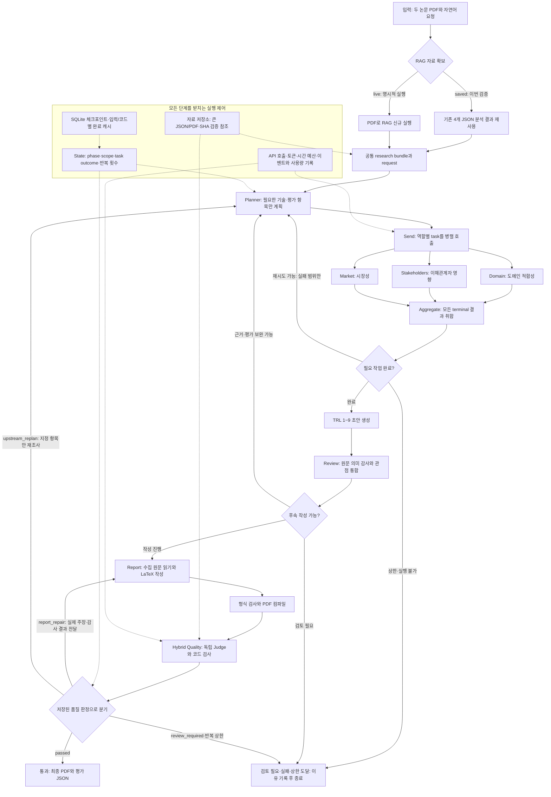

# 모델 구조와 실제 실행 방식

이 문서는 현재 `pipeline/` 코드의 실행 구조를 설명합니다. 아래 화살표는 작업의 실행·분기 순서이며, 임베딩 공간에서 문장 사이의 유사도를 나타내는 그래프가 아닙니다. 실제 최종 보고서의 품질 판정은 실행별 `quality.json`을 확인해야 합니다.

## 전체 구조

## 역할과 흐름 제어의 구분

| 구분 | 실제 역할 |
| --- | --- |
| RAG 경계 | 기술 자료를 확보합니다. 그래프 실행 전에 saved/live를 결정합니다. 이번 검증은 기존 결과를 재사용했으며 검색·임베딩을 새로 실행한 검증은 아닙니다. |
| Planner / dispatch | 저장된 평가 셀을 기준으로 누락·무효·수정 대상만 역할별 task로 만듭니다. 계획은 요청 범위를 정확히 덮어야 합니다. `dispatch`는 계획의 task를 `Send`로 전달합니다. |
| 관점 평가 역할 | Domain, Stakeholders, Market이 같은 논문 자료와 요청을 독립적으로 사용합니다. 현재 구현은 역할 간 결과 입력 의존성을 허용하지 않습니다. |
| Aggregate | worker 결과의 단일 병합 작성자입니다. 모든 task가 완료 또는 실패 상태에 도달하면 요청 범위만 병합하고, 다른 성공 항목은 보존합니다. |
| TRL / Review | 모델의 단계별 초안을 원문·대상 구현·검증 방식과 대조합니다. 보고서의 TRL은 Review의 최종 팀 추정입니다. |
| Report / Quality | Report는 문서를 쓰고 PDF를 생성합니다. 별도 Quality가 실제 생성 파일을 평가합니다. PDF 생성 성공과 내용 품질 통과는 서로 다른 상태입니다. |

현재 두 기술의 평가 범위는 Domain 20셀, Stakeholders 2셀, Market 12셀입니다. 셀은 `(역할, 기술, 평가 항목)` 조합을 뜻하며 에이전트 개수를 뜻하지 않습니다. 초기 전체 평가와 보완 재조사는 작업 범위가 달라질 수 있습니다.

## TRL이 최종 PDF에 들어가는 과정

1. `pipeline/trl.py`가 선정 기술별 자료와 9단계 rubric으로 `met / not_met / unknown`, 이유, 근거 ID를 생성합니다.
2. `pipeline/review_bridge.py`가 기존 평가 자료를 canonical 원문 document/evidence에 연결합니다.
3. Review가 기술 대상과 검증 방법을 의미 감사하고 1단계부터 연속으로 확인한 최고 단계를 `synthesis.trl`로 확정합니다. 높은 단계 하나만 확인됐다고 낮은 단계 공백을 건너뛰지 않습니다.
4. Report가 Review의 단계·근거·한계·다음 검증 조건을 본문에 작성합니다. Quality가 실제 PDF의 TRL 표시와 Review의 값이 일치하는지 확인합니다.

공식 인증이 아닌 공개 정보 기반 팀 추정입니다. 현재 실험에서 나온 RDKV 6 / Photonic-CXL 4 역시 이 평가 방식의 결과이며, 선정 논문과 인접 제품의 실적은 구분해야 합니다.

## 품질 평가와 수정 루프

결정론적 검사는 PDF 생성, 10쪽 이내 분량, 구조·인용·TRL 보존, 자료 SHA와 평가 완료 범위를 확인합니다. 독립 Judge는 실제 PDF 문장을 원자적 주장으로 분리하고 원문과 대조한 뒤 근거성, 중립성, 편향 통제, 관점 포괄성을 평가합니다. 점수만으로 승인하지 않으며 필수 기준과 미해결 중대 오류도 함께 확인합니다.

- 본문·숫자·인용 귀속을 수정할 수 있으면 `report_repair`로 기존 보고서와 실제 주장·감사 결과를 Report에 전달합니다. 모든 피드백 위치를 실제 본문에서 찾을 수 있으면 해당 구간만 JSON 패치로 수정합니다. 선택하지 않은 본문·제목·검사 경계는 보존하며 전체 원문을 계속 전달합니다. 위치를 전부 확인할 수 없으면 이유를 기록하고 기존 전체 문서 수정으로 전환합니다. 적용 후 전체 문서를 다시 검사합니다.
- 참고문헌은 등록 서지 형식과 실제 PDF의 표시가 모두 일치하는 범위만 식별 메타데이터로 처리합니다. Review가 승인한 정확한 TRL 표시도 별도로 추적하지만, 그 근거와 주변 주장은 독립 Judge의 의미 검사를 계속 받습니다. 원문과 반대라고 판정하려면 명시적인 반대 명제와 원문 인용이 필요합니다.
- 근거나 역할별 평가를 보완해야 하면 `upstream_replan`으로 지정 기술·항목만 재조사합니다.
- 완료 가능한 검사가 없거나 검토가 필요하면 `review_required`, 반복 상한에 도달하면 실패 상태로 종료합니다.
- 기본 재계획 상한은 2회, 완료된 내용 품질 평가 상한은 3회입니다. 실패한 기술 호출과 형식 수정은 별도 상태로 기록하며 사용량을 초기화하지 않습니다.

이 도식은 가능한 코드 경로입니다. 실제 실행이 어느 경로를 통과했는지는 `run.json`, `events.jsonl`, `quality.json`과 체크포인트 기록으로 확인합니다. LangSmith 연결 코드는 유지되어 있으나 이번 검증에서 실제 trace를 확보했다고 주장하지 않습니다.

## 코드 대응표

| 도식 단계 | 구현 |
| --- | --- |
| 입력·RAG 모드·실행 진입 | [pipeline/__main__.py](../pipeline/__main__.py), [inputs.py](../pipeline/inputs.py), [rag/runner.py](../rag/runner.py) |
| 셀·task·공유 State·reducer | [contracts.py](../pipeline/contracts.py) |
| 동적 계획 | [planner.py](../pipeline/planner.py) |
| Send·worker·취합·조건 분기 | [graph.py](../pipeline/graph.py) |
| 역할별 입력 변환·실제 호출 | [worker_adapters.py](../pipeline/worker_adapters.py), [runtime.py](../pipeline/runtime.py) |
| TRL·Review | [trl.py](../pipeline/trl.py), [review_bridge.py](../pipeline/review_bridge.py), [team_review](../agent/review/team_review/) |
| 원문 분석·작성·컴파일 | [reporting.py](../pipeline/reporting.py), [report/src/report_agent](../report/src/report_agent/) |
| 주장 대조·rubric·품질 gate | [report_quality.py](../pipeline/report_quality.py) |
| 자료 참조·캐시·복구·예산 | [artifacts.py](../pipeline/artifacts.py), [checkpoint.py](../pipeline/checkpoint.py), [governance.py](../pipeline/governance.py) |
