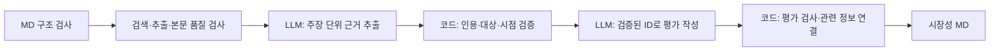

# MD 입력 기반 시장조사 에이전트

기술 조사 담당자의 Markdown 입력에서 RDKV(SW)와 Photonic-CXL(HW)의 시장성을 조사합니다. [설치 안내](../README.md)에 따라 가상환경을 준비하고 이 패키지의 상위 폴더 `market-research-agent`에서 실행합니다.

## 1. 실행

```bash
# API 호출 없이 입력 확인
python -m market_agent.cli --input market_agent/fixtures/input.md --mode parse
# 고정 응답으로 실행·저장·재사용 동작 확인
python -m market_agent.cli --input market_agent/fixtures/input.md --mode fixture
# 실제 조사
python -m market_agent.cli --input market_agent/fixtures/input.md --mode live --debug
```

실제 실행에는 프로젝트 루트의 `.env`에 OPENAI_API_KEY와 TAVILY_API_KEY가 필요합니다. `.env.example`에는 빈 항목만 있으며 실제 키는 Git에서 제외합니다. 기본 모델은 gpt-4.1-mini이며 `--model`로 변경할 수 있습니다. 프로세스 환경변수가 `.env`보다 우선하며 `--env-file`로 다른 파일을 지정합니다.

실제 실행은 검색어·URL을 Tavily에 보내고, 기술 정보·수집 문단·검증된 근거를 OpenAI에 보냅니다. `fixture` 결과는 실제 시장 조사가 아닙니다.

## 2. 결과와 내부 기록

| 위치 | 내용 |
| --- | --- |
| `market_agent/outputs/<실행시각>/market_handoff.md` | 통합 에이전트에 전달할 시장성 12개 항목과 인용 |
| `market_agent/.cache/<출력경로 해시>/run.json` | 결과·오류·사용량·후보/검토 통과 근거 풀·자료/주장별 검토·포함/제외 기록 |
| 내부 캐시 `sources/`, `manifest.json` | 실제 추출 응답과 파일 무결성 검사 |
| 내부 캐시 `debug.json` | `--debug` 사용 시 추출/평가 단계별 모델 응답과 Graph 경로 |

외부 전달은 MD 한 개입니다. `--output <새 폴더>`로 저장 위치를 지정합니다. 기존 출력은 덮어쓰지 않습니다. 최종 공유용으로 검토한 파일은 별도 `deliverables/`에 보관할 수 있습니다.

내부 스냅샷 버전은 **0.3**입니다. 기존 0.2 보고서는 보존하며 새 성공 캐시로 자동 재사용하지 않습니다. 재사용은 같은 입력·코드·모델·프롬프트·버전·파일 해시가 맞고 현재 오류가 없는 경우에만 가능합니다.

```bash
python -m market_agent.cli --input market_agent/fixtures/input.md --mode fixture --output market_agent/outputs/my_demo
python -m market_agent.cli --input market_agent/fixtures/input.md --mode fixture --output market_agent/outputs/my_demo --reuse
```

`unknown`은 판단할 직접 근거가 부족한 상태입니다. 처리 오류는 내부 errors와 해당 행의 사유를 함께 확인해야 합니다. CLI 종료 코드 0은 completed/unknown, 2는 입력·인증 등의 실패입니다. 종료 코드만으로 보고서 내용이 충분하다고 판단하지 않습니다.

## 3. 현재 처리 흐름



전체 흐름에서 보완은 최대 1회입니다. 근거가 부족하면 검색부터, 인용 오류면 보유 원문에서 추출부터, 평가의 ID 연결 오류면 평가 작성만 보완합니다. 기존 자료를 이미 검토했고 추가 원문이 없으면 같은 추출을 반복하지 않습니다.

- **원문 품질:** 접근 성공과 내용 확보를 구분합니다. 제목·메타데이터·메뉴뿐인 페이지는 분석 원문으로 사용하지 않습니다. 같은 논문 버전의 대체 경로 조회는 최대 1회입니다. 이 검사는 휴리스틱이며 내용의 진실성을 보장하지 않습니다.
- **근거 추출:** 코드가 고정한 원문 구절 ID를 모델이 선택합니다. 구절은 최대 100단어의 완전한 문장, 자료당 최대 10개입니다. 링크 조각과 일부 수식 깨짐을 제외하고, 최종 MD의 발췌는 URL당 25단어로 제한합니다. 각 Claim은 한 출처의 한 인용에 연결됩니다. 다른 논문·제품의 근거를 선정 기술의 근거로 승격하지 않습니다. 웹 추출 모델에는 전달받은 요약을 인용 후보로 제공하지 않습니다. 이전 부모 상태를 검증할 때만 고객 가치의 조건부 추론에 제한적으로 허용합니다.
- **평가 작성:** 모델은 각 Claim의 한국어 주장이 인용문으로 뒷받침되는지 재검토하고 Claim ID를 참조합니다. 누락·거부된 주장은 출력하지 않고 제외 이유를 남깁니다. 코드가 직접 근거 없는 항목을 unknown으로 고정하며, 확인된 평가 문장은 검토 통과 Claim의 문장으로 구성합니다. 새 URL·인용문·성과를 최종 작성 단계에서 추가하지 않습니다.
- **관련 정보 보존:** 선정 논문의 판정이 unknown이어도 검증된 관련 제품·기술군 정보는 별도로 보존합니다. 항목당 유용한 정보 1건을 우선하며 다른 근거의 제외 이유를 내부 기록에 남깁니다.
- **판단 범위:** fact는 공급사/저자의 보고일 수 있습니다. inference에는 성립 조건을 표시합니다. exact는 선정 기술 자체, method_family/adjacent는 관련 기술군·인접 시장입니다.

## 4. 입력과 예산

입력 v0.1의 필수 구역은 실행 정보, 기술 목록, 논문 기반 기술 요약, 근거 목록, 추가 요청 및 정보 공백입니다. 임의 형식의 모든 Markdown을 해석하는 파서는 아닙니다. 샘플 `fixtures/input.md`는 수작업 인터페이스 샘플이라는 출처 상태를 유지합니다.

| 자원 | 현재 입력 상한 | 사용 방식 |
| --- | ---: | --- |
| 검색 | 6회 | 초기 두 기술 각 1질의, 필요한 경우 보완 최대 2질의; 전송 재시도 포함 |
| 원문 조회 | 10회 | 최초 최대 6시도, 보완용 잔여 확보; 대체 URL·실패도 차감 |
| LLM | 5회 | 기본 근거 추출 1 + 평가 1, 필요한 단계의 논리적 보완 최대 1; 전송 재시도 포함 |

상한은 목표 사용량이 아닙니다. 유효 본문이 없으면 LLM을 호출하지 않습니다. 근거 풀이 비어 있으면 평가 작성 호출을 생략합니다. 작은 한도에서 추출만 가능하면 새 주장은 내부 후보로 보존하고 의미 검토 미완료 사유를 남깁니다. 이전 회차에서 검토를 마친 근거는 유지할 수 있습니다. SDK 자동 재시도는 끄고 공통 Budget에서만 시도 수를 관리합니다.

## 5. 코드 읽기

| 파일 | 책임 |
| --- | --- |
| parser.py / schemas.py | 입력 파싱, 근거·Claim·평가 계약 |
| tools.py | API 경계, 실패 처리, 시도 단위 예산 |
| sources.py / collection.py | 후보 순위, 본문 품질, 대체 경로, 문단 선택 |
| search_plan.py | 기술 자체·기술군·항목에 맞춘 검색어 |
| providers.py / prompts.py | 근거 추출과 평가 작성의 별도 구조화 출력 |
| quotes.py / claims.py | Claim 검증·ID 발급, 평가 ID 변환, 관련 정보와 제외 사유 |
| node.py | LangGraph 단계·보완 경로·부모 변경분 |
| validation.py / research.py | 최종 인용 검사, 실제 검토·처리 오류·미확인 사유 |
| report.py / cli.py | 단일 MD 출력, 내부 캐시·무결성·재사용 |

## 6. 부모 Graph에 연결

```python
from market_agent.parser import read_input
from market_agent.node import run_market, parent_update
from market_agent.schemas import Limits
from market_agent.tools import Budget

data = read_input("market_agent/fixtures/input.md")
market_budget = Budget(Limits(search=6, extract=10, llm=5))
# web/analyst는 TavilyWeb/OpenAIAnalyst 또는 fixture 객체
first = run_market(data, web, analyst, budget=market_budget, auto_repair=False)
delta = parent_update(first)
second = run_market(data, web, analyst, budget=market_budget,
    auto_repair=False, round_number=1, previous=first["analysis"],
    existing_evidence=first["evidence"], existing_claims=first["claim_pool"])
```

`parent_update`는 assessments.market, 새 documents, 새 evidence, errors만 반환합니다. 부모는 ID 기준으로 병합하고 다른 역할의 결과를 유지해야 합니다. 같은 시장 예산을 회차 간 재사용하며 다른 역할의 전역 예산 객체를 그대로 공유하지 않습니다.

기존 previous/기존 evidence 계약에서는 단일 인용의 이전 근거를 재검증해 복구합니다. 새 연결에서는 existing_claims도 전달하는 것이 명확합니다. 내부 근거 상태와 필요한 실행 이력을 부모 checkpoint에 보존하는 전체 통합은 별도 작업입니다. 총 문서 페이지 집계도 부모의 책임입니다.

## 7. 검증과 한계

```bash
python -m unittest discover -s market_agent/tests -v
python -m compileall -q market_agent
```

80개 회귀 검사로 형식·호출 상한·인용 문자열·출처 연결·의미 검토 누락 차단을 확인했습니다. 의미 검토 모델의 동의 자체가 진실성의 증명은 아닙니다. 주장 의미의 타당성, 시장 정보의 완전성, 공급사 주장의 독립 검증까지 보장하지는 않습니다. 사실·추론을 실제 보고서에 사용하기 전에 원문과 적용 범위를 대조해야 합니다. 상세 실행 결과는 [검증 기록](LIVE_VALIDATION.md)에 있습니다.
