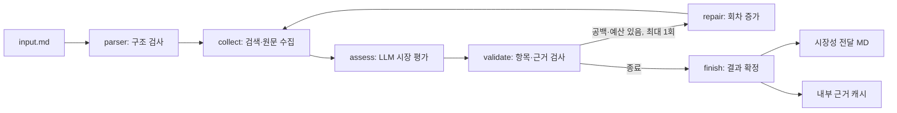

# MD 입력 기반 시장조사 에이전트

기술 조사 담당자가 만든 `input.md`를 읽고 RDKV(SW)와 Photonic-CXL(HW)을 같은 시장 기준으로 평가합니다. 외부 입력과 보고서는 Markdown이며, Python 내부에서만 Pydantic 객체를 사용합니다.

## 1. 지금 실행하기

먼저 [프로젝트 실행 안내](../README.md)에 따라 Python 3.11 가상환경과 의존성을 준비합니다. 아래 명령은 `market-research-agent` 폴더에서 가상환경을 활성화한 뒤 실행합니다.

```bash
# 현재 위치: market-research-agent (가상환경 활성화 후)

# 입력 구조만 확인: API를 호출하지 않습니다.
python -m market_agent.cli --input market_agent/fixtures/input.md --mode parse

# 전체 동작 연습: 가상 검색·가상 모델 응답, 실제 API 호출 0회
python -m market_agent.cli --input market_agent/fixtures/input.md --mode fixture

# 실제 웹 검색 및 LLM 시장 평가
python -m market_agent.cli --input market_agent/fixtures/input.md --mode live
```

`live` 모드는 `.env`의 `OPENAI_API_KEY`, `TAVILY_API_KEY`가 필요합니다. 키 값에는 Markdown의 역슬래시나 링크 문법을 넣지 않습니다. 기본 모델은 `gpt-4.1-mini`이며 `--model`로 바꿀 수 있습니다. 프로세스 환경변수가 `.env`보다 우선합니다. 다른 설정 파일은 `--env-file 경로`로 지정합니다.

실제 실행에서는 입력 문서와 수집 근거를 OpenAI에, 검색어와 조회 URL을 Tavily에 보냅니다. 키는 결과 파일에 저장하지 않습니다. 이 코드가 읽는 `.env` 항목은 두 API 키이며, 그 파일의 추적 설정을 별도로 활성화하지 않습니다.

**fixture 보고서는 실제 시장 조사 결과가 아닙니다.** 의도적으로 모든 평가를 `unknown`으로 표시하여, 자료가 없는 상태를 어떻게 전달하는지 확인합니다. 실제 시장 판단은 `live` 실행 후 출처를 대조해야 합니다.

## 2. 결과 확인하기

실행이 끝나면 보고서의 절대 경로가 터미널에 표시됩니다. 기본 저장 위치는 `market_agent/outputs/실행시각/`입니다.

| 위치 | 파일 | 용도 |
| --- | --- | --- |
| 전달 폴더 | `market_handoff.md` | 통합 보고서에 삽입할 시장성 12개 항목과 실제 인용 출처 |
| 내부 `.cache/<출력경로 해시>/` | `input.md`, `run.json` | 입력 사본, 최종 결과·현재 오류·조사 범위·사용량·부모 변경분 |
| 내부 캐시 | `sources/WEB-….md`, `manifest.json` | 전체 Extract 응답과 재사용 무결성 검사 |

통합 에이전트에는 **전달 폴더의 MD 한 개만** 넘깁니다. 내부 캐시 위치는 `market_agent.cli.cache_path(output)`으로 계산할 수 있습니다. 과거 실행 폴더는 보존합니다.

기술별로 시장 규모·성장, 제품화, 실제 채택, 생태계 지원, 표준화, 고객 가치·사업화 조건을 평가합니다. 따라서 항상 **2개 기술 × 6개 항목 = 12개 평가**가 나옵니다.

| 결과 표시 | 의미 |
| --- | --- |
| `favorable / conditional / unfavorable / unknown / not_applicable` | `verdict`: 공통 평가 판정. 조직의 목표가 미정이면 무조건적 긍정·부정으로 확정하지 않음 |
| `fact` | 모델이 근거에 명시된 사실로 분류한 주장. 사람의 원문 대조 필요 |
| `inference` | 근거를 바탕으로 한 해석. 성립 조건을 함께 확인 |
| `unknown` | 이번 실행에서 확인할 자료가 부족하거나 검사를 통과하지 못함 |
| `exact` | 선정한 기술 자체와의 관계 |
| `method_family` | KV 양자화, CXL 확장 등 같은 기술군과의 관계 |
| `adjacent` | AI 서버 등 인접 시장과의 관계 |

전체 상태 `unknown`은 프로그램 오류와 같지 않습니다. 일부 항목이 미확인이어도 확인된 결과는 남습니다. 인증 실패나 평가를 전혀 수행하지 못한 주요 오류는 `failed`와 오류 코드로 표시합니다. CLI 종료 코드는 `completed/unknown`일 때 0, 입력·인증 등의 실패 시 2입니다.

## 3. 코드 흐름 이해하기



LangGraph는 이 실행 순서와 조건 분기를 관리합니다. 그래프의 State는 기술 입력, 수집한 근거, 평가 결과, 오류, 현재 회차를 담습니다. LLM은 시장 평가와 다음 검색 질문을 작성하며, 실제 호출 여부와 반복 횟수는 Python 코드가 정합니다.

| 파일 | 읽을 때 볼 부분 |
| --- | --- |
| `parser.py` | `read_input`, `parse_markdown`: 제목·표·근거 앵커 → 내부 입력 |
| `schemas.py` | `MarketInput`, `Analysis`, `MarketResult`: 입력과 출력 형식 |
| `tools.py` | `Budget`: 재시도를 포함한 호출 횟수 / `TavilyWeb`: 검색과 원문 조회 |
| `node.py` | `run_market`: StateGraph와 조건 분기 / `parent_update`: 부모용 결과 |
| `search_plan.py` | 항목 목적에 맞춘 최초·보완 질의, 중복 방지 |
| `collection.py`, `sources.py` | 단계별 원문 예산, 후보 순위, 질문별 문단·위치 선택 |
| `research.py` | 실제 실행 기록에서 항목별 조사 상태·미확인 원인 계산 |
| `providers.py` | 실제 OpenAI 모델과 고정 테스트 응답의 교체 |
| `prompts.py` | 시장 평가 기준, 사실·추론·자료 범위 구분 |
| `validation.py` | 없는 근거 ID, 중복 평가, 초록만으로 채택을 주장한 결과 검사 |
| `report.py` | 검사를 통과한 결과를 MD로 출력 |
| `cli.py` | 실행 옵션, 키 확인, 파일 저장과 재사용 |

## 4. 입력과 호출 한도

현재 파서는 첨부 파일의 5개 구역을 계약으로 사용합니다: `실행 정보`, `기술 목록`, `논문 기반 기술 요약`, `근거 목록`, `추가 요청 및 정보 공백`. 임의 형식의 Markdown을 자동 해석하는 범용 파서는 아닙니다. 테스트용 원본 사본은 `fixtures/input.md`에 있습니다.

현재 입력의 제목은 이해관계자용이지만 실행 역할은 시장 조사로 고정됩니다. 입력이 수작업 샘플이고 근거가 초록 요약이라는 상태도 보존됩니다. 본문 속 지시문은 자료로 취급합니다.

| 자원 | 전체 실행 한도 | 동작 |
| --- | --- | --- |
| 검색 | 6회 | 처음 두 기술에 각 1질의, 보완 시 최대 2질의. 일시적 실패 재시도 포함 |
| 원문 | 10회 | 질의당 후보 최대 3개. 입력 논문 직접 조회 포함 최초 최대 6시도, 보완용 4시도 확보. 재시도·대체 URL도 차감 |
| LLM | 입력 상한 5회 | 회차당 1평가, 보완 최대 1회, 일시적 오류 재시도 1회씩으로 계획상 최대 4시도 |

한도는 목표 사용량이 아닙니다. 원문을 하나도 확보하지 못하면 LLM 평가를 생략하고 미확인을 반환합니다. SDK 자동 재시도는 끄고 `Budget`에서만 재시도합니다. 기준일 이후의 출처는 제외하고 날짜가 없으면 시점 미확인 조건을 붙입니다. 같은 URL·본문은 중복 조회·등록을 줄입니다. RDKV 약어만 일치하는 TV·셋톱박스 자료는 제외하고 KV cache 관련 문맥을 함께 확인합니다.

## 5. 저장 결과 재사용

```bash
python -m market_agent.cli --input market_agent/fixtures/input.md --mode fixture --output market_agent/outputs/my_demo
python -m market_agent.cli --input market_agent/fixtures/input.md --mode fixture --output market_agent/outputs/my_demo --reuse
```

두 번째 명령은 저장된 결과를 보여주며 API를 새로 호출하지 않습니다. 입력·실행 모드·모델·프롬프트·코드가 바뀌면 재사용을 거부합니다. 오류가 있는 실행도 재사용하지 않습니다. 새 조사에는 새 출력 폴더를 사용합니다. `--reuse`는 최신 웹 자료 재검색을 의미하지 않습니다.

## 6. 팀의 상위 Graph에 연결하기

현재 프로젝트에는 팀 전체를 실행하는 부모 Graph가 없습니다. 시장 역할은 `run_market`과 `parent_update`로 연결할 수 있습니다.

```python
from market_agent.parser import read_input
from market_agent.node import run_market, parent_update
from market_agent.schemas import Limits
from market_agent.tools import Budget

data = read_input("market_agent/fixtures/input.md")
# web/analyst는 실행기가 생성한 TavilyWeb/OpenAIAnalyst 또는 fixture 객체
# 다른 역할과 구분하여 시장 역할에 배정한 예산을 사용합니다.
market_budget = Budget(Limits(search=6, extract=10, llm=5))
first = run_market(data, web, analyst, budget=market_budget, auto_repair=False)
delta = parent_update(first)

# 부모가 보완을 결정한 경우에만: 같은 입력·예산 객체를 유지합니다.
second = run_market(data, web, analyst, budget=market_budget,
    auto_repair=False, round_number=1, previous=first["analysis"],
    existing_evidence=first["evidence"])
```

`delta`는 `assessments.market`, 새 `documents`, 새 `evidence`, `errors`만 반환합니다. 부모는 ID 기준 Map reducer로 병합해야 합니다. `assessments` 전체를 단순 대입하면 다른 역할 결과가 사라질 수 있습니다. 부모에서 보완을 관리할 때 `auto_repair=False`를 사용합니다.

예산 객체는 시장 역할의 두 회차에서 재사용합니다. 다른 역할도 소비하는 전역 예산 객체를 직접 넘기지 말고 부모가 역할별로 할당합니다. 더 작은 입력 한도가 있으면 시장 예산을 축소합니다. 프로세스 재시작, 부모 checkpoint, 전체 문서 200쪽 집계는 부모 통합 단계에서 처리해야 합니다. 웹 텍스트의 `page_count`는 알 수 없으므로 `None`입니다.

## 7. 현재 검증 범위와 한계

- 실제 첨부 MD의 2개 기술·2개 근거·6/10/5 한도를 확인했습니다.
- 고정 응답으로 파싱, HTTP 요청·응답 처리, 설치된 OpenAI SDK의 구조화 출력, 오류 처리, Graph, 보고서 저장·재사용을 검사합니다.
- 최신 회귀 테스트는 58개입니다. 실제 실행 및 내용 검토 결과는 [라이브 검증 기록](LIVE_VALIDATION.md)에 기록합니다.
- 두 키 설정 후 실제 Tavily 검색·원문 조회와 OpenAI 구조화 평가 연결을 확인했습니다. 실행별 호출량과 출처 검토는 [라이브 검증 기록](LIVE_VALIDATION.md)을 참고하세요.
- 자동 검사는 형식과 근거 참조를 확인합니다. 인용한 원문이 주장을 실제로 뒷받침하는지까지 증명하지는 않습니다.
- 제목·검색 발췌에서 기술명 또는 KV cache·CXL·추론 인프라 관련 단서를 확인한 후보를 두 기술에 번갈아 배분합니다. 제외한 후보와 이유는 `run.json`의 `queries[].candidates`에 남습니다. 이 검사는 일반 제품 문서를 줄이기 위한 최소 필터이며, 모든 출처를 공식 자료로 인증하지 않습니다. 관련 자료도 검색 발췌에 단서가 없으면 제외될 수 있습니다.
- LLM에 보내는 원문은 관련 문단과 주변 조건을 선택한 자료당 최대 12,000자입니다. 원문 문자 위치·제목·해시를 보존합니다. 전체 Extract 응답은 내부 캐시의 `sources/`에 남지만 이미지·표·유료 페이지까지 완전하게 읽었다고 볼 수 없습니다.
- 작은 검색 예산이므로 두 논문의 전 세계 시장을 빠짐없이 조사하는 범위는 아닙니다. 부족한 항목은 미확인으로 남깁니다.

```bash
python -m unittest discover -s market_agent/tests -v
python -m compileall -q market_agent
```

## 8. 직접 바꾸면서 학습할 부분

1. **입력의 검색·원문·LLM 한도를 모두 0으로 변경:** 외부 호출 없이 12개 미확인 평가와 예산 부족 이유가 유지되는지 확인합니다. 검색만 0으로 두면 입력 논문 URL의 직접 조회는 가능합니다. 원본 대신 사본을 편집하세요.
2. **`search_plan.py`의 `initial_questions` 검색어 변경:** 수집 URL과 출처 범위가 달라집니다. 같은 기준일로 새 출력 폴더에서 비교합니다.
3. **`prompts.py`에 고객 가치 평가 조건 추가:** 결과의 `conditions`, `gaps`가 더 구체화되는지 봅니다. 근거가 없는 숫자를 요구하지 않습니다.
4. **`auto_repair=False`로 실행:** 최초 결과와 한 차례 보완한 결과의 근거 수·미확인 항목·호출 수를 비교합니다.

참고한 API 계약: [LangGraph Graph API](https://docs.langchain.com/oss/python/langgraph/graph-api), [Tavily Search](https://docs.tavily.com/documentation/api-reference/endpoint/search), [Tavily Extract](https://docs.tavily.com/documentation/api-reference/endpoint/extract).

## 통합 전달 출력 v0.2

`--output` 폴더에는 `market_handoff.md` 한 개만 생성한다. SW/HW 각각 6개 시장성 항목과 실제 인용 출처를 담는다. `verdict`는 공통 평가 판정, `basis`는 사실·추론·미확인 구분이다. 선정 기술의 미확인과 관련 기술군 정보가 함께 존재할 수 있다.

입력 v0.1은 유지한다. 최종 실행 상태·전체 원문·근거·파일 해시는 패키지 `.cache/`에 따로 보존한다. 이 폴더는 Git과 전달 목록에서 제외된다. `--reuse --output <폴더>`는 같은 입력·코드·모델·프롬프트·버전 및 저장 파일 무결성을 확인하고 API 호출 없이 기존 결과를 재사용한다. 구형 출력이나 변경·손상된 파일은 새 검증 결과로 자동 승격하지 않는다. 과거 `market_report.md` 파일은 보존된다.

### 진단이 필요한 경우

`--debug`를 추가하면 내부 캐시에 `debug.json`으로 회차별 모델 평가와 Graph 이동 순서를 보존합니다. 전달 폴더에는 여전히 MD 한 개만 생성됩니다. 기본 실행도 필수 인용 필드 누락 여부와 최종 유효 오류를 내부 기록으로 남깁니다. 이 옵션은 중간 결과를 조사할 때 사용하며 보고서 본문에 로그를 추가하지 않습니다.

필수 출력 필드가 누락된 모델 응답을 빈 인용으로 채우지 않고 오류로 처리합니다. 설치된 SDK가 보내는 전체 필수 JSON Schema를 검사하며 [OpenAI Structured Outputs 계약](https://developers.openai.com/api/docs/guides/structured-outputs#all-fields-must-be-required)을 참고합니다. 원문 인용 검사는 주장 의미의 타당성까지 증명하지 않으므로 실제 인용은 별도로 대조합니다.
