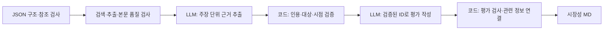

# JSON 입력 기반 시장조사 에이전트

> 현재 전달 계약은 0.5입니다. 최종 항목은 unknown 대신 근거 기반·잠정평가·기술 시나리오로 제공합니다. JSON 기본 한도는 검색 18 / 원문 24 / LLM 10회입니다. [현재 설계](../docs/PROGRESSIVE_DELIVERY.md)를 우선 참고하세요. 아래 이전 회차 설명은 구형 동작일 수 있습니다.
기술 조사 담당자의 paper_analysis JSON 입력에서 RDKV(SW)와 Photonic-CXL(HW)의 시장성을 조사합니다. [설치 안내](../README.md)에 따라 가상환경을 준비하고 이 패키지의 상위 폴더 `market-research-agent`에서 실행합니다.

## 1. 실행

```bash
# API 호출 없이 입력 확인
python -m market_agent.cli --input market_agent/fixtures/paper_analysis_sw.json market_agent/fixtures/paper_analysis_hw.json --mode parse
# 고정 응답으로 실행·저장·재사용 동작 확인
python -m market_agent.cli --input market_agent/fixtures/paper_analysis_sw.json market_agent/fixtures/paper_analysis_hw.json --mode fixture
# 실제 조사
python -m market_agent.cli --input market_agent/fixtures/paper_analysis_sw.json market_agent/fixtures/paper_analysis_hw.json --mode live --debug
```

실제 실행에는 프로젝트 루트의 `.env`에 OPENAI_API_KEY와 TAVILY_API_KEY가 필요합니다. `.env.example`에는 빈 항목만 있으며 실제 키는 Git에서 제외합니다. 기본 모델은 gpt-4.1-mini이며 `--model`로 변경할 수 있습니다. 프로세스 환경변수가 `.env`보다 우선하며 `--env-file`로 다른 파일을 지정합니다.

실제 실행은 검색어·URL을 Tavily에 보내고, 기술 정보·수집 문단·검증된 근거를 OpenAI에 보냅니다. `fixture` 결과는 실제 시장 조사가 아닙니다.

## 2. 결과와 내부 기록

| 위치 | 내용 |
| --- | --- |
| `market_agent/outputs/<실행시각>/market_handoff.md` | 통합 에이전트에 전달할 기술당 시장성 6개 항목과 인용 |
| `market_agent/.cache/<출력경로 해시>/run.json` | 결과·오류·사용량·후보/검토 통과 근거 풀·자료/주장별 검토·포함/제외 기록 |
| 내부 캐시 `sources/`, `manifest.json` | 실제 추출 응답과 파일 무결성 검사 |
| 내부 캐시 `debug.json` | `--debug` 사용 시 추출/평가 단계별 모델 응답과 Graph 경로 |

외부 전달은 MD 한 개입니다. `--output <새 폴더>`로 저장 위치를 지정합니다. 기존 출력은 덮어쓰지 않습니다. 최종 공유용으로 검토한 파일은 별도 `deliverables/`에 보관할 수 있습니다.

내부 스냅샷 버전은 **0.4**입니다. 기존 0.2/0.3 보고서는 보존하며 새 성공 캐시로 자동 재사용하지 않습니다. 재사용은 같은 입력·코드·모델·프롬프트·버전·파일 해시가 맞고 현재 오류가 없는 경우에만 가능합니다.

```bash
python -m market_agent.cli --input market_agent/fixtures/paper_analysis_sw.json market_agent/fixtures/paper_analysis_hw.json --mode fixture --output market_agent/outputs/my_demo
python -m market_agent.cli --input market_agent/fixtures/paper_analysis_sw.json market_agent/fixtures/paper_analysis_hw.json --mode fixture --output market_agent/outputs/my_demo --reuse
```

`unknown`은 선정 기술에 대한 시장 판정입니다. `execution_status`는 completed/partial/failed로 실행 상태를 별도 표시합니다. CLI 종료 코드는 완료 0, 부분 처리 3, 입력·인증 등의 치명적 실패 2입니다. 미조사 항목이나 현재 처리 오류가 남으면 partial이며, unknown만 있다는 이유로 실행 실패가 되지는 않습니다.

## 3. 현재 처리 흐름



추가 수집·추출 교정·평가 교정은 각각 최대 1회이며 전체 시도 상한 6/10/5를 공유합니다. 초기 질의 최대 2개, 보완 질의 최대 4개를 배분합니다. 자료 수집과 인용 교정을 함께 처리할 수 있고, 추출 재시도에서도 실제 제공자의 평가 작성·최종 검토 각 1시도를 예약합니다. 검토 목적이 추가되면 같은 원문을 새 호출 없이 재검토합니다.

- **원문 품질:** 접근 성공과 내용 확보를 구분합니다. 제목·메타데이터·메뉴뿐인 페이지는 분석 원문으로 사용하지 않습니다. 같은 논문 버전의 대체 경로 조회는 최대 1회입니다. 이 검사는 휴리스틱이며 내용의 진실성을 보장하지 않습니다.
- **근거 추출:** 코드가 고정한 원문 구절 ID를 호출별 enum으로 모델에 제공하며 로컬에서도 참조를 검사합니다. JSON의 상위 근거 ID는 배경 투영에서 제외하고 원본에는 보존합니다. 구절은 최대 100단어의 완전한 문장, 자료당 최대 10개입니다. 탐색 문구와 일부 수식 깨짐을 제외하고 제품명 링크가 있는 실질 문장은 보존하며, 최종 MD의 발췌는 URL당 25단어로 제한합니다. 각 Claim은 한 출처의 한 인용에 연결됩니다. 다른 논문·제품의 근거를 선정 기술의 근거로 승격하지 않습니다. 웹 추출 모델에는 전달받은 요약을 인용 후보로 제공하지 않습니다. 이전 부모 상태를 검증할 때만 고객 가치의 조건부 추론에 제한적으로 허용합니다.
- **평가 작성:** 모델은 각 Claim의 한국어 주장이 인용문으로 뒷받침되는지 재검토하고 Claim ID를 참조합니다. 누락·거부된 주장은 출력하지 않고 제외 이유를 남깁니다. 코드가 직접 근거 없는 항목을 unknown으로 고정하며, 확인된 평가 문장은 검토 통과 Claim의 문장으로 구성합니다. 새 URL·인용문·성과를 최종 작성 단계에서 추가하지 않습니다.
- **관련 정보 보존:** 선정 논문의 판정이 unknown이어도 검증된 관련 제품·기술군 정보는 별도로 보존합니다. 항목당 유용한 정보 1건을 우선하며 다른 근거의 제외 이유를 내부 기록에 남깁니다.
- **판단 범위:** fact는 공급사/저자의 보고일 수 있습니다. inference에는 성립 조건을 표시합니다. exact는 선정 기술 자체, method_family/adjacent는 관련 기술군·인접 시장입니다.

## 4. 입력과 예산

현재 팀 입력은 기술 조사 dossier 두 개·registry·comparison의 JSON 4개다. 아래 `paper_analysis` JSON 1.1.0도 호환 지원한다. 하나 또는 두 논문 객체를 받으며 기술 개수에 따라 6행/12행을 출력한다. 논문 메타데이터·기술 분석·원래 근거 ID·페이지를 보존하고, 상태/참조를 API 호출 전에 검사한다. JSON에 없는 시장 기준일은 실행일, 도메인은 cloud_datacenter, 호출 한도는 아래 기본값을 사용하며 CLI 옵션으로 바꿀 수 있다.

상위 `quality`, `run` 등은 내부에 보존하고 시장 사실이나 실행 설정으로 자동 승격하지 않는다. `source_path`는 읽지 않는다. HW 예시처럼 공개 URL이 없으면 제목으로 검색한다. 기존 MD v0.1 입력은 호환 지원한다. 상세 규격·실행 예제는 [JSON 입력 안내](../docs/JSON_INPUT.md)에 있다.

| 자원 | 현재 입력 상한 | 사용 방식 |
| --- | ---: | --- |
| 검색 | 6회 | 초기 두 기술 각 1질의, 필요한 경우 보완 최대 2질의; 전송 재시도 포함 |
| 원문 조회 | 10회 | 최초 최대 6시도, 보완용 잔여 확보; 대체 URL·실패도 차감 |
| LLM | 5회 | 기본 근거 추출 1 + 평가 1, 필요한 단계의 논리적 보완 최대 1; 전송 재시도 포함 |

상한은 목표 사용량이 아닙니다. 유효 본문이 없으면 LLM을 호출하지 않습니다. 근거 풀이 비어 있으면 평가 작성 호출을 생략합니다. 작은 한도에서 추출만 가능하면 새 주장은 내부 후보로 보존하고 의미 검토 미완료 사유를 남깁니다. 이전 회차에서 검토를 마친 근거는 유지할 수 있습니다. SDK 자동 재시도는 끄고 공통 Budget에서만 시도 수를 관리합니다.

## 5. 코드 읽기

| 파일 | 책임 |
| --- | --- |
| parser.py / json_input.py / schemas.py | 입력 파싱, 근거·Claim·평가 계약 |
| tools.py | API 경계, 실패 처리, 시도 단위 예산 |
| sources.py / collection.py | 후보 순위, 본문 품질, 대체 경로, 문단 선택 |
| search_plan.py | 기술 자체·기술군·항목에 맞춘 검색어 |
| providers.py / prompts.py | 근거 추출과 평가 작성의 별도 구조화 출력 |
| quotes.py / claims.py | Claim 검증·ID 발급, 평가 ID 변환, 관련 정보와 제외 사유 |
| node.py | LangGraph 단계·보완 경로·부모 변경분 |
| validation.py / research.py | 최종 인용 검사, 실제 검토·처리 오류·미확인 사유 |
| report.py / cli.py | 단일 MD 출력, 내부 캐시·무결성·재사용 |

## 6. 부모 Graph에 연결

```python
from market_agent.parser import read_input
from market_agent.node import run_market, parent_update
from market_agent.schemas import Limits
from market_agent.tools import Budget

data = read_input(["technical_sw.json", "technical_hw.json"], as_of="2026-09-22")
market_budget = Budget(Limits(search=6, extract=10, llm=5))
# web/analyst는 TavilyWeb/OpenAIAnalyst 또는 fixture 객체
first = run_market(data, web, analyst, budget=market_budget, auto_repair=False)
delta = parent_update(first)
second = run_market(data, web, analyst, budget=market_budget,
    auto_repair=False, round_number=1, previous=first["analysis"],
    existing_evidence=first["evidence"], existing_claims=first["claim_pool"])
```

`parent_update`는 assessments.market, 새 documents, 새 evidence, errors만 반환합니다. 부모는 ID 기준으로 병합하고 다른 역할의 결과를 유지해야 합니다. 같은 시장 예산을 회차 간 재사용하며 다른 역할의 전역 예산 객체를 그대로 공유하지 않습니다.

기존 previous/기존 evidence 계약에서는 단일 인용의 이전 근거를 재검증해 복구합니다. 새 연결에서는 existing_claims도 전달하는 것이 명확합니다. 내부 근거 상태와 필요한 실행 이력을 부모 checkpoint에 보존하는 전체 통합은 별도 작업입니다. 총 문서 페이지 집계도 부모의 책임입니다.

## 7. 검증과 한계

```bash
python -m unittest discover -s market_agent/tests -v
python -m compileall -q market_agent
```

회귀 검사로 형식·호출 상한·인용 문자열·출처 연결·의미 검토 누락 차단을 확인했습니다. 의미 검토 모델의 동의 자체가 진실성의 증명은 아닙니다. 주장 의미의 타당성, 시장 정보의 완전성, 공급사 주장의 독립 검증까지 보장하지는 않습니다. 사실·추론을 실제 보고서에 사용하기 전에 원문과 적용 범위를 대조해야 합니다. 상세 실행 결과는 [검증 기록](LIVE_VALIDATION.md)에 있습니다.


## JSON 신뢰성 개선 v1.2 / 내부 계약 0.4

- 추출은 실제 인용 ID만 선택하며 출처별 검토 항목을 기록합니다. 후보는 전체 12개·항목당 2개로 균등 배분합니다.
- 대상 표현은 선택 구절 또는 주변 문맥에 실제로 있어야 합니다. 문서의 다른 곳에 논문 이름이 있다는 이유로 동일성을 인정하지 않습니다. 관련 제품을 선정 논문 상용화로 바꾸지 않습니다.
- 의미 검토는 인용 지지, 시장 관련성, 대상 관계, 조건 보존, 실증 수준을 각각 확인합니다. 전망·계획은 조건부 추론으로 유지합니다.
- 시장 수치는 값뿐 아니라 단위·통화·연도·지역·시장 정의·전망 여부가 같은 인용에 연결돼야 합니다.
- `run.json`은 추출 이력과 현재 오류, 검토 결과를 보존합니다. 통합 MD에는 해당 평가에 필요한 제한만 표시합니다.
- 부모 후속 호출은 같은 `Budget`을 공유합니다. 별도 프로세스로 재개하면 `previous_progress=previous_result.progress`와 기존 evidence/claims를 함께 전달하고 부모가 사용량을 이어서 관리해야 합니다.
- 기존 MD 입력과 Python 호출은 유지하지만 0.4 실행 상태·CLI 부분 종료 코드 3을 호출자가 처리해야 합니다. 구버전 캐시는 새 성공 결과로 재사용하지 않습니다.


### 팀 입력: technical bundle 1.0.0

`--input`에 dossier 두 개, 공통 `evidence_registry.json` 배열, `comparison.json`을 함께 지정합니다. `dossier_version`과 `comparison_version`은 1.0.0입니다. 기존 paper_analysis 1.1.0 및 MD도 지원합니다. 입력은 `technical_bundle_json`으로 정규화됩니다.

- 공유 registry의 모든 evidence/document 참조와 본문·문서 해시를 검사합니다.
- dossier의 analysis, claims, experiment_observations, critical_inventory 참조를 검사합니다.
- comparison의 논문·근거·관측 ID 연결을 검사하고 비교 금지 조건과 결합 가설의 미검증 전제를 보존합니다.
- 원본 4개 문서는 내부 캐시에 보존하며 경로·실행 지시를 따르지 않습니다.
- 모델에 전달하는 기술 배경에서 상위 ID를 제외합니다. 제공 발췌는 독립 확인된 시장 원문으로 승격하지 않습니다.
- 후속 부모 호출에는 기존 evidence/analysis와 `result.progress` 또는 같은 Budget 객체를 유지합니다. progress는 오류·검토 이력도 포함하므로 단순 재호출로 오류가 지워지지 않습니다.


### API 호출 없는 결과 재검증

`python -m market_agent.revalidate --snapshot <캐시>/run.json --output <새 폴더>`로 저장 해시를 검사한 뒤 현재 로컬 검증 규칙을 다시 적용할 수 있습니다. 기존에 의미 검토를 통과한 후보에서 범위가 부적절한 주장을 제외하며 새로운 시장 사실이나 문장을 생성하지 않습니다. 이전 오류·한도·unknown을 보존하고 원본을 덮어쓰지 않습니다. 최신 예시는 LIVE_VALIDATION.md를 참고하세요.


## 항목별 근거 정책 v1.3

- 제품화·실제 채택: 선정 기술과 연결된 직접 근거가 필요합니다.
- 시장 규모·생태계 지원·표준화·고객 가치: 검토된 관련 기술군·인접 시장 근거와 적용 조건으로 conditional 평가할 수 있습니다. 최종 basis는 inference로 보존합니다.
- 기술 조사 입력의 등록 발췌는 고객 가치의 기술적 전제로 사용할 수 있습니다. 독립 확인된 웹 사실·실제 고객 ROI로 승격하지 않습니다.
- 추출은 기술·항목별 최대 2개 슬롯을 사용합니다. 관련 근거를 채택해도 입력 기술의 제품화·고객 도입을 입증하는 것은 아닙니다.
- million/billion 등의 배율과 단위를 정규화하되 생산량/생산능력/매출, 대상, 지역, 연도와 실제/전망을 구분합니다.
- 처리 완료 여부와 시장 판정은 계속 분리합니다. 최종 결과·오류·사용량은 [라이브 검증 기록](LIVE_VALIDATION.md)을 확인하세요.
