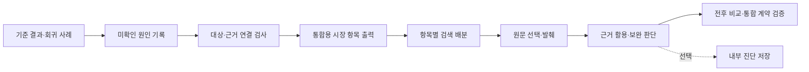

# 시장조사 에이전트 최종 수정 계획 v1.0

- 작성일: 2026-09-21
- 상태: **2026-09-22 필수 구현·재실행 완료. 실제 완료 기록은 todo.md와 LIVE_VALIDATION.md에 기록했다. R7의 전체 이력 확장은 선택 사항으로 남긴다.**
- 기준 구현: `833e77d` (라이브 검색 관련성 필터 보완까지 반영).
- 대상 실행: `20260921_204551_802887`, 입력 `Downloads/input.md`.
- 작업 목록: [tasks/todo.md의 R1~R9](todo.md).
- 전달 양식: [시장성 전달 MD 템플릿](../docs/MARKET_HANDOFF_TEMPLATE.md). 실제 평가를 채우기 전의 양식이며 새 조사 결과가 아니다.
- 기존 첫 구현은 완료했다. 이전 작업·검증 이력은 `todo.md`와 Git 이력에 유지한다.
- 최신 사용자 확정: **외부 결과물은 통합 에이전트가 평가보고서에 삽입할 시장 담당 항목만 작성한다.** 아래 전달 계약이 이전의 독립 보고서 확장 제안을 대체한다.

## 1. 수정 목표

**평가보고서의 시장성 담당 항목을 채워 통합 에이전트에 전달할 Markdown을 만든다.** 각 결론에 적용 조건·근거·미확인을 연결해 통합 과정에서 의미가 바뀌지 않게 한다.

미확인 항목이 7개에서 몇 개로 줄어야 한다는 목표는 두지 않는다. 근거 검사를 강화하면 기존 fact가 unknown으로 바뀔 수도 있다. 성공 기준은 출처와 판단 범위의 정확성, 조사 과정의 설명 가능성이다.

외부 입력과 출력은 계속 Markdown으로 사용한다. 기존 Python 3.11, LangGraph, Pydantic, Tavily, OpenAI 환경을 활용하며 검색 6회 / 원문 10회 / LLM 5회라는 입력 상한 안에서 우선 개선한다.

### 통합 에이전트에 넘길 내용 — 확정된 출력 방향

[현재 설계보고서](https://docs.google.com/document/d/1kAe2OCkaH4kBoKlj5EkMLxdEnS-BIhBcd0GH6e7IVCo/edit)의 6.1절, 7절, 9절을 2026-09-21에 다시 읽고 다음과 같이 대응했다.

| 최종 평가보고서의 위치 | 시장 에이전트가 전달할 내용 |
| --- | --- |
| 관점별 평가 → 시장성 → SW-01 | RDKV의 시장성 평가 항목 |
| 관점별 평가 → 시장성 → HW-01 | Photonic-CXL의 시장성 평가 항목 |
| 한계점에 사용할 자료 | 각 시장 평가에 연결된 자료 공백·적용 조건·판단 보류 이유 |
| REFERENCE에 사용할 자료 | 시장 평가에서 실제로 인용한 근거의 ID·발행자·제목·날짜·URL·원문 위치 |

두 기술의 시장성 항목은 기존 6개를 유지한다: **시장 규모·성장, 제품화, 실제 채택, 생태계 지원, 표준화, 비용·고객 가치·사업화 조건.** 마지막 항목은 현재 설계보고서 6.1의 시장성 범위에 포함된다. 최종 보고서의 시장성 두 칸 안에 들어가는 세부 항목이며, 전체 보고서의 새 절을 만들지 않는다.

각 항목의 전달 필드는 다음으로 제한한다.

| 필드 | 전달 목적 |
| --- | --- |
| 기술 ID·항목 ID | 통합 에이전트가 올바른 칸에 배치 |
| 평가 내용·판정 | 해당 항목에 들어갈 본문과 공통 판정값 |
| 근거 성격·적용 범위 | 원문 보고/추론, 선정 기술/기술군/인접 시장을 구분 |
| 적용 조건·미확인 사항 | 결론의 전제와 자료 공백을 유지 |
| 근거 ID | 실제 인용한 출처와 연결 |

공통 판정값은 설계보고서의 favorable/conditional/unfavorable/unknown/not_applicable에 맞추며, fact/inference라는 근거 성격과 혼동하지 않는다. 적용 가능성을 뒷받침하는 근거가 있고 조건을 명시할 수 있으면 conditional을 사용할 수 있다. 목표가 미정이면 favorable/unfavorable을 단정하지 않고, 결론 자체를 뒷받침할 근거가 부족하면 unknown을 쓴다. 적용 대상이 아니라는 근거가 있을 때만 not_applicable을 쓴다. failed는 실행 제어 상태로 전달하며 기술의 부정적 판정으로 바꾸지 않는다.

전달 MD의 확정 파일명은 `market_handoff.md`이며, 구조는 아래와 같다. 2026-09-22 코드에 적용했다.

```text
시장성 평가
  SW-01 · RDKV
    6개 항목의 평가 내용 / 판정 / 근거 성격·범위 / 조건·미확인 / 근거 ID
  HW-01 · Photonic-CXL
    6개 항목의 평가 내용 / 판정 / 근거 성격·범위 / 조건·미확인 / 근거 ID
  인용 근거
    위 항목에서 실제로 인용한 출처와 원문 위치
```

평가 시점·도메인은 해석에 필요한 최소 범위 정보로 한 줄에 표시할 수 있다. API 호출량, 모델 설정, 검색어 전체, 디버깅 기록, 테스트 결과, 실행 안내, 다음 개발 작업은 전달 MD에 넣지 않는다. SUMMARY, 분석 배경, 기술 개요, 타 관점 평가, 관점 간 상충, 전체 시사점·최종 참고문헌 조립은 통합 담당이 수행한다.

상세 unknown 원인 코드·다음 검색 질문·회차 진단은 내부 실행과 보완 판단에 사용한다. 통합용 본문에는 결과 해석에 필요한 한계만 간결하게 남긴다. 독립적인 시장 종합 보고서·중복 비교표·별도 사람용 보고서를 기본 산출물로 추가하지 않는다. 현재 실행 기록과 과거 산출물은 이 계획 단계에서 삭제하지 않는다.

### 필드와 저장 방식 — 구현 기준

기존 `judgment`는 평가 본문으로 유지하고 공통 판정은 새 `verdict` 필드에 저장한다. `basis`는 fact/inference/unknown을 유지한다. 두 값을 기계적으로 변환하지 않는다. 근거가 있는 제품 발표도 채택 조건에 따라 conditional 또는 unknown일 수 있다.

| 전달 표의 열 | 내부 필드 | 작성 규칙 |
| --- | --- | --- |
| 항목 ID·항목 | `criterion_id` | 기존 6개 ID 유지, 기술 ID는 절 제목에 표시 |
| 평가 내용 | `judgment`, 필요한 `context_findings` | 선정 기술의 결론을 먼저 쓰고 기술군 보조 정보의 대상을 명시 |
| 판정 | `verdict` | 공통 5종 판정 중 하나, failed는 본문 판정에서 제외 |
| 근거 성격·범위 | `basis`, `relation_to_technology` | fact/inference/unknown 및 exact/method_family/adjacent/unknown 유지. 보조 정보에는 자체 범위를 표시 |
| 적용 조건·미확인 | `conditions`, `gaps` | 의미 있는 전제·공백만 전달. 판단 보류 시 구체적인 이유 포함 |
| 근거 ID | `evidence_ids`와 보조 정보의 인용 ID | 전달한 주장에 실제로 사용한 ID만 기록 |

- `--output <폴더>`는 전달 폴더를 뜻하며 그 안에는 `market_handoff.md` 한 개만 생성한다. 기존 폴더를 덮어쓰지 않는다.
- 기본 재검증·재사용 자료는 별도 `market_agent/.cache/<출력 절대경로의 SHA-256>/`에 보존한다. 최소 저장 대상은 입력 사본, 최종 상태, 근거 메타데이터, 전체 원문, 파일 해시, 모델·프롬프트·코드 식별값이다. 패키지 `.gitignore`에 `.cache/`를 추가한다. 이 내부 자료는 통합 에이전트의 파일 전달 목록에 포함하지 않는다.
- 상세 검색 후보·중간 모델 응답·회차 이력의 추가 저장은 R7의 선택 기능이다. 필수적인 최종 상태·현재 오류·무결성 정보는 R8에서 저장하므로 R7 없이도 재사용 검사와 실패 판별이 가능해야 한다.
- `--reuse --output <폴더>`는 기존 결과 확인만 수행하며 API를 호출하지 않는다. 입력·모델·코드·프롬프트·출력 버전 및 저장 자료 해시를 검사하고, 불일치·자료 누락·실패 기록이면 이유를 반환한다. 자동 재조사로 전환하지 않는다.
- 내부 `output_schema_version`은 `0.2`로 추가하고 입력 `schema_version=0.1`은 유지한다. 버전 없는 기존 결과는 구형 자료로 읽되 새 판정·조사 상태를 임의로 채우지 않는다. 새 출력 검증이 필요한 구형 결과는 재사용 대상에서 제외하고 과거 파일을 보존한다.
- 인용 근거 표에는 ID·제목·발행자·발행일·조회일·URL·공개 원문 위치·접근 범위·판단을 뒷받침하는 짧은 발췌를 넣는다. 날짜 미확인은 미확인으로 표시한다. 로컬 파일 경로만으로 근거를 전달하지 않는다. 현재 MD만 받은 통합 에이전트도 문맥과 출처를 확인할 수 있어야 한다.
- 부분 실패 시 검증된 항목을 보존하고 나머지는 판단 보류 이유를 채운다. 실행 실패 여부는 기존 반환 상태·오류 변경분·CLI 종료 코드로 전달한다. 입력이 유효하지 않아 기술·항목을 결정할 수 없으면 평가 MD를 생성하지 않는다.

## 2. 이번 출력에서 확인된 상태

| 항목 | 관측 결과 |
| --- | --- |
| 평가 구조 | 기술 2개 × 기준 6개 = 12개 |
| 자동 분류 | fact 3개, inference 2개, unknown 7개. 사람의 최종 승인 수치가 아님 |
| 검색 | 4회, SW·HW에 각각 최초 1회와 보완 1회 |
| 원문 조회 | 10회 시도 중 9회 성공, 1회 실패 |
| 근거 상태 | 입력 요약 2개, 웹 원문 9개, 검색 발췌 2개 |
| 남은 원문 미확보 원인 | NOSA PDF 조회 실패 1건, Structera 공식 자료 예산 소진 1건 |
| 기존 자동 테스트 | 35개 통과. 실세계 주장 내용의 정확성을 보장하는 검사는 아님 |

근거: 최종 실행 기록: `market_agent/outputs/20260921_204551_802887/run.json` (원본 작업공간 기록, 이관 제외), 자동 보고서: `market_agent/outputs/20260921_204551_802887/market_report.md` (원본 작업공간 기록, 이관 제외), [원문 대조 기록](../market_agent/LIVE_VALIDATION.md).

### 확인된 문제와 영향

| 우선순위 | 확인한 문제 | 영향 | 수정 방향 |
| --- | --- | --- | --- |
| P0 | HW 제품·지원·표준화 3항목을 fact/exact로 분류했지만, 논문과 제품 버전의 동일성은 미검증 | 제품군 발표를 선정 논문의 실적으로 받아들일 위험 | 주장별 대상과 연결 근거 검사, 공급사 발표와 독립 검증 구분 |
| P0 | unknown의 이유가 자유 서술뿐이며 조사하지 않은 경우와 조사 실패를 구분할 필드가 없음 | 사용자가 기술 정보의 부재와 검색 한계를 구분하기 어려움 | 항목별 조사 상태와 미확인 원인 기록 |
| P1 | `initial_questions`는 기술마다 1개, 각 회차 `questions[:2]` 제한 | 재시도가 없으면 최대 4질의. 생태계 지원·표준화를 겨냥한 질의가 이번 실행에 없음 | 평가 기준을 연결한 검색 계획과 우선순위 배분 |
| P1 | 관련성 검사는 키워드 포함 여부이며 후보는 검색 순서로 조회 | 같은 기술군 문서가 많이 들어오고 중요한 공식 자료를 뒤늦게 조회할 수 있음 | 항목 관련성, 원문 성격, 중복, 대상 일치 정도를 함께 고려 |
| P1 | 모델에 원문의 앞 12,000자만 전달 | 메뉴·소개가 길면 근거 문단을 놓칠 수 있음 | 평가 질문에 맞는 문단 선택과 정확한 원문 위치 보존 |
| P1 | 검증기는 ID와 원문 존재를 주로 확인하고, exact는 모델이 붙인 값을 사용 | 실제 주장과 인용 내용의 일치 여부가 약함 | 주장별 발췌·대상·적용 범위 검사 |
| P2 | 오류에 회차·해결 상태가 없고 중간 모델 결과를 저장하지 않음 | 최초 회차의 수정된 오류가 최종 오류로 읽힘 | 회차별 결과와 현재 남은 문제 분리 |

관련 코드: [검색·수집](../market_agent/node.py), [본문 전달 범위](../market_agent/node.py), [판정 검사](../market_agent/validation.py), [저장 항목](../market_agent/cli.py).

**검증할 가설:** 항목별 공식 자료 질의와 본문 발췌를 개선하면 유효 근거 활용이 늘어날 수 있다. 현재 자료만으로 실제 공개 정보의 부족과 검색 누락의 비중을 확정할 수는 없다.

## 3. 7개 미확인 항목의 수정 방향

| 기술·항목 | 조사 방향 | 자료를 찾았을 때의 결과 | 계속 부족할 때의 결과 |
| --- | --- | --- | --- |
| RDKV 시장 규모·성장 | RDKV 자체의 상용 시장과 KV 최적화·추론 인프라의 관련 시장을 구분. 정의·연도·지역·단위가 있는 통계 원문 탐색 | 관련 시장 규모는 배경 정보로 기록. RDKV 시장 규모로 대입하지 않음 | 이번에 확인한 범위와 통계 미확보 이유, 후속 출처 유형 기록 |
| RDKV 제품화 | 입력 논문·저자·공식 저장소 연결, 라이선스·공개 상태·상용 배포 자료 확인 | 연구 코드 공개 / 제품 출시 / 고객 판매 상태를 구분 | 논문이나 코드만으로 상용 제품을 판정하지 않음 |
| RDKV 실제 채택 | RDKV를 명시한 고객 사례·운영 발표·릴리스 자료 탐색 | 연구 실험 / 파일럿 / 실제 운영을 구분 | 조사한 출처와 미확인 이유를 명시. 도입 사례가 전혀 없다고 단정하지 않음 |
| RDKV 생태계 지원 | 공식 추론 엔진 문서·저장소·릴리스에서 기술명·논문 인용·기능·버전 확인 | 일반 KV 양자화 지원은 기술군 정보로 보존, RDKV 직접 지원은 별도 근거 필요 | 기술군 지원 정보와 RDKV 직접 지원 미확인을 함께 제시 가능 |
| RDKV 표준화 | 적용되는 인터페이스·형식·표준 및 평가 항목의 적용 필요성 확인 | 관련 표준과 역할을 명시. 표준화가 필요한지 판단할 근거도 제시 | 현재는 적용 여부 미확인으로 기록. 검색 실패를 ‘해당 없음’으로 바꾸지 않음 |
| Photonic-CXL 시장 규모·성장 | 선정 구현과 CXL 메모리·광 인터커넥트·AI 메모리 인프라 시장을 구분 | 범위가 정의된 관련 시장 수치와 해당 구현의 관계 설명 | 시장 정의가 다른 수치 합산과 임의 점유율 추정 금지 |
| Photonic-CXL 실제 채택 | 논문 구현·발표 제품·버전·운영 고객의 연결 자료 탐색 | 공급사 발표 / 샘플 제공 / 고객 시험 / 상용 운영을 구분 | 제품 발표가 있어도 실제 채택은 미확인으로 유지 가능 |

이 표는 조사 과제 목록이다. 검색 6회 안에 7개 항목을 각각 독립적으로 충분히 조사할 수 있다고 약속하지 않는다.

## 4. 수정 설계

### A. 선정 기술의 결론과 관련 시장 정보를 함께 표현

각 항목은 선정 기술에 대한 `judgment/basis`를 유지하고, `context_findings`에 기술군·인접 시장의 보조 정보를 담는 방향으로 확장한다.

예시 형식이며 실제 시장 사실을 추가한 것은 아니다:

| 구분 | 보고서 표현 예시 |
| --- | --- |
| 선정 기술 | RDKV를 직접 지원하는 추론 엔진은 이번 조사에서 확인하지 못함 |
| 관련 기술군 | 원문 A에서 특정 KV 양자화 방식의 지원을 설명함. RDKV와의 동일성은 미검증 |
| 다음 확인 | 공식 저장소에서 RDKV 논문 인용과 구현 버전을 확인 |

관련 기술군의 사실을 추가해도 선정 기술의 `basis=unknown`을 자동 해제하지 않는다. 제품·표준을 설명할 때 대상은 RDKV, 논문 구현, PF-NIC 등 실제 근거가 가리키는 이름으로 명시한다. 입력 요약에 있는 별칭은 검색 단서이며 동일 구현의 확정 근거로 취급하지 않는다.

### B. ‘왜 미확인인가’를 내부에서 구조화

`basis`와 별도로 `research_status`, `unknown_reasons`, `next_action`, `search_ids`, `reviewed_evidence_ids`를 내부에 기록한다. `research_status`는 not_started/searched/reviewed로 두고 실제 수행된 검색·근거 검토로 갱신한다. 다른 질의로 확보한 근거를 검토했다면 직접 검색하지 않았어도 reviewed가 될 수 있다. 구형 기록에 없는 상태는 null로 유지한다. 전달 MD에는 이 중 해당 평가의 의미에 필요한 미확인 이유만 문장으로 옮긴다.

| 미확인 원인 | 의미 |
| --- | --- |
| `not_searched` | 이 항목을 직접 겨냥한 조사나 관련 근거 검토가 아직 없음 |
| `no_relevant_source` | 검색했으나 관련 후보를 확보하지 못함 |
| `source_inaccessible` | 관련 후보는 있으나 원문 조회 실패 |
| `budget_exhausted` | 예산 때문에 필요한 조회·평가를 수행하지 못함 |
| `insufficient_evidence` | 자료는 읽었으나 결론을 뒷받침하지 못함 |
| `identity_unverified` | 논문·제품·구현·버전의 연결이 미검증 |
| `conflicting_sources` | 자료 간 주장이나 조건이 충돌 |
| `date_unverified` | 기준일 당시의 상태를 판단할 날짜 근거 부족 |

한 항목에 여러 원인이 있을 수 있다. 원문 조회 실패·예산 소진 같은 실행 상태는 코드가 기록하며, 모델이 추측해서 채우지 않는다. ‘직접 질의를 하지 않았음’과 ‘다른 질의로 얻은 관련 근거를 검토했음’도 구분한다.

설계보고서의 `not_applicable`은 적용 대상이 아니라는 근거와 이유가 있을 때만 사용한다. 표준화 자료를 찾지 못했다는 이유로 자동 지정하지 않는다.

### C. 호출 예산 안에서 조사 계획을 배분

현재 `collect → assess → validate → 최대 1회 repair` 흐름을 유지한다. 코드로 12개 항목의 조사표를 만들고, 질의마다 대상 기술·관련 항목·필요한 출처·선정 이유를 연결한다. 별도 계획 LLM을 추가하지 않는다.

| 자원 | 제안 배분 | 주의점 |
| --- | --- | --- |
| 검색 6시도 | 현행 설계대로 회차당 최대 2질의, 보완 최대 1회 | 최대 4논리 질의이며 재시도도 전체 6시도 상한에 포함. 키 설정 후 재확인한 설계보고서 3절의 회차 한도를 유지 |
| 최초 질의 | SW 1개, HW 1개. 직접 구현·제품 또는 중요 공백에 맞춰 선택 | 질의 하나가 여러 항목에 도움이 될 수 있으나 자동으로 조사 완료로 표시하지 않음 |
| 보완 질의 | 검증 실패, 직접 연결 부족, 원문 미확보, 아직 조사하지 못한 중요 항목 중 우선순위가 높은 것 | 동일 질의 반복은 명시적 재시도 사유가 있을 때만 수행 |
| 원문 10시도 | 최초 최대 6시도, 보완용 최소 4시도를 우선 확보 | 입력 논문 URL을 직접 확인하면 그 시도도 포함. 새 출처·재조회·대체 URL 모두 차감 |
| LLM 5시도 | 평가 1회 + 보완 평가 1회, 일시적 오류 재시도 포함 계획상 최대 4시도 | 별도 무제한 검토 모델을 추가하지 않음 |

표의 수치는 입력 한도가 6/10/5일 때의 배분안이다. 더 작은 입력·부모 할당 한도에서는 전체 상한을 우선하며, 못한 작업은 조사표에 남긴다. 보완이 필요 없으면 예약 예산을 소비하지 않는다.

이번 입력에서 선택할 질의 후보 예시이며 실제 검색 결과가 아니다. 최초에는 이 중 SW/HW 각 1개만 선택한다:

| 질의 예시 | 주된 조사 목적 |
| --- | --- |
| `"RDKV" implementation license` | RDKV의 직접 구현·공개 상태·제품화 단서 |
| `Marvell Photonic Fabric memory appliance product` | 관련 제품과 선정 논문의 연결·발표 상태 |
| `KV cache quantization inference engine support documentation` | 기술군 지원 정보를 확인하고 RDKV 직접 지원과 구분 |
| `CXL memory pooling market size forecast` | 범위가 정의된 관련 시장 통계 탐색 |

보완 최대 2질의는 최초 결과와 남은 시도 예산을 보고 배분한다. 예를 들어 SW 시장 통계와 HW 직접 채택 근거가 우선 후보가 될 수 있다. 표준화 등까지 충분히 조사하지 못하면 내부 조사표에 `not_searched` 또는 다른 질의를 통해 검토한 범위를 명시한다. 위 4개 문자열을 모든 입력에 고정하지 않고 기술명·미확인 항목에 따라 계획한다. 이전 계획의 최초 4질의 확대안은 기본 수정 범위에서 제외한다.

자료의 우선순위는 ‘현재 항목에 대한 직접성 → 발행 성격 → 중복 여부 → 시점 → 검색 순위’로 검토한다. 공식 문서도 해당 질문과 무관하면 우선하지 않는다. 현재 필터에서 통과했거나 도메인이 공식이라는 이유만으로 정확한 근거로 인증하지 않는다.

### D. 본문에서 판단에 필요한 문단을 가져오기

- 전체 Extract 반환 텍스트는 위에서 정한 내부 캐시에 저장한다.
- 메뉴·반복 푸터를 줄이고, 기술명·논문 ID·제품명·평가 항목 주변 문단을 선택한다. 앞 12,000자라는 고정 위치 대신 선택한 문단의 합계 길이를 제한한다.
- 발췌마다 원문 파일·행 또는 문자 위치·해시를 남겨 다시 찾을 수 있게 한다. 해석에 필요한 제한·부정 문장을 포함한다.
- 직접 입력된 논문 URL은 제목·저자·버전·ID를 확인할 대상으로 사용한다. URL이 있다는 사실만으로 원문 검증 완료로 승격하지 않는다.
- PDF 조회 실패 시 제공자가 지원하는 HTML/초록 URL을 조회하는 방안을 검토하되, 연결을 확인할 수 있는 공개 URL만 사용하고 원문 한도에 포함한다. 초록을 확보한 경우 접근 범위를 Abstract로 명시한다.

### E. 주장과 인용을 함께 검사

확인된 사실·추론에는 주장별 `evidence_id`, 짧은 발췌, 원문 위치, 주장 대상, 자료 관계, 발행 성격을 연결한다.

1. 코드: ID 존재, 발췌의 실제 원문 포함 여부, 위치·날짜·수치 단위, 접근 상태, 예산 검사.
2. 평가: 원문이 해당 주장을 직접 말하는지, 논문·제품 연결이 무엇인지, 공급사 설명인지 독립 검증인지 명시.
3. 제한: 이름이나 CXL 단어만 일치한다고 exact를 확정하지 않는다. 논문 ID·구현 버전·명시적 연결 자료가 불충분하면 선정 기술에 대한 fact 판정을 보류하고, 제품군 사실은 보조 정보로 남긴다.

발췌가 실제 존재한다는 사실만으로 주장의 의미까지 증명할 수는 없다. 자동 검사 통과 여부와 사람의 내용 검토 상태를 별도로 표시한다. 충돌·동일성 미검증은 후속 검토로 남긴다.

### F. 통합용 항목 출력과 내부 진단

- 기본 외부 출력은 시장 담당 항목과 인용 근거를 담은 전달 MD 한 개로 정한다.
- 실행 상태·현재 남은 오류·보완 질문은 내부 제어 데이터로 유지한다. 과거에 해결된 오류를 최종 실패로 집계하지 않는 처리는 R6의 필수 범위다. 전체 진단 저장 확장은 디버깅 옵션으로 한정하고 기본 전달물에 포함하지 않는다.
- 두 기술의 6개 항목에 선정 기술 결론, 필요한 관련 기술군 정보, 조건·미확인, 근거를 넣는다. 다음 개발 작업과 전체 검색 과정은 본문에서 제거한다.
- `fact`는 ‘자료에 명시된 주장’이며, 공급사 발표·독립 검증·조건부 추론의 차이를 해당 평가의 근거 성격으로 표시한다.
- 최종 SUMMARY·전체 한계점·REFERENCE는 통합 에이전트가 시장 전달본과 다른 역할 결과를 합쳐 조립한다.

## 5. 구현 순서와 의존관계



작업별 변경 파일, 수용 기준, 검증 방법은 [작업 목록](todo.md)에 기록한다. **R1 → R2 → R3 → R8 → R4 → R5 → R6 → R9** 순서로 수행한다. 전달 범위를 먼저 맞추고 검색 품질을 개선한다. R7의 상세 진단 저장 확장은 필요할 때 별도로 수행한다.

## 6. 검증과 완료 기준

| 검증 대상 | 완료 기준 |
| --- | --- |
| 전달 범위 | 최종 보고서의 시장성 SW/HW 두 칸에 들어갈 12개 세부 항목과 인용 근거만 포함 |
| 조사 상태 | 내부에서 12개 항목 모두 검색·근거 검토 여부 또는 미수행 이유 확인 가능 |
| unknown | 전달 항목에 간결한 판단 보류 이유가 있고, 후속 조사 방향은 내부에서 관리 |
| 근거 연결 | 사실·추론마다 주장 대상, 자료 ID, 실제 발췌 위치, 자료 범위가 있음 |
| 동일성 | 정해둔 회귀 사례에서 기술군 지원·제품 발표를 선정 논문의 직접 채택으로 승격한 사례 0건 |
| 수치 | 정의·지역·연도·단위가 없는 시장 규모·성장률·ROI를 생성하지 않음 |
| 검색·원문 | 한도 초과 0회. 관련 공식 자료가 단순 순위 때문에 밀린 사례를 기준 데이터에서 재현·검사 |
| 회차·부분 실패 | 남은 유효 결과와 필요한 한계를 전달하고 상세 진단·보완 제어는 내부 처리 |
| 불필요한 내용 | 전달 MD에 전체 SUMMARY·다른 역할 항목·API 로그·테스트 결과·개발 안내·미인용 출처가 없음 |
| 호환성 | 기존 MD 입력·fixture·CLI·부모의 market 변경분 계약 유지. 내부 결과 확장은 버전으로 구분 |
| 실세계 검토 | 인용된 긍정 주장 모두 원문 대조. 동일성·공급사 주장·시점의 남은 불확실성을 기록 |

### 검증 순서

1. 저장된 출력과 원문으로 회귀 사례를 만든다. 발췌·판정·표시 검사는 외부 호출 없이 수행한다.
2. 테스트 제공자로 검색 응답과 모델 응답을 고정해 예산·보완·실패 흐름을 검사한다.
3. 기존 35개 테스트를 유지하고, 새 기준의 테스트 및 `compileall`을 실행한다.
4. 통과 후 동일 입력·기준일·모델·한도를 사용하는 라이브 비교 실행 1회를 기본으로 한다. 전후 차이와 실제 원문을 대조한다.

기존 `run.json`에는 매 회차의 원시 모델 결과와 검색 발췌 전체가 없으므로, 오프라인 검사를 당시 네트워크 실행의 완전한 재현이라고 부르지 않는다. 수정 전후 라이브 검색 결과도 시점과 검색 서비스에 따라 바뀔 수 있다.

후속 실행이 필요하면 구체적 실패 원인을 먼저 기록한다. 미확인 개수를 줄이기 위한 반복 호출은 하지 않는다. 비용은 호출 횟수·토큰 사용량으로 비교하며 이번 계획에서 요금을 추정하지 않는다.

## 7. 출력 계약과 작업 경계

- MD 입력 v0.1의 5개 구역과 실제 입력 원본을 유지한다.
- 새 내부 필드는 출력 버전으로 구분하고 기존 저장 파일은 읽을 수 있게 한다. 과거 결과를 새 검증을 통과한 결과처럼 자동 승격하지 않는다.
- 공유 Map의 `assessments.market`, 새 문서·근거·오류 변경분 원칙을 유지한다. 제어 상태의 오류·로그를 보고서 본문에 그대로 노출하지 않으며, 통합용 MD는 담당 평가 항목만 직렬화한다.
- 모델 교체, 임베딩 DB 추가, 자유로운 에이전트 반복, 팀의 부모 Graph 전체 개발은 이번 최소 수정 범위에 포함하지 않는다.
- 조사 지역이 입력에 없으므로 출처의 지역을 기록한다. 여러 지역·시장 정의의 숫자를 임의로 합치지 않는다.

## 8. 위험과 남은 결정

| 위험 | 대응 |
| --- | --- |
| 공개 자료 자체가 부족함 | 조사 과정을 남기고 unknown 유지. 관련 시장 정보를 별도로 제시 |
| 공식 발표를 실제 배포로 오해 | 발표·샘플·파일럿·상용 운용을 분리하고 발행자 표시 |
| 본문 선택이 반대 근거를 누락 | 앞뒤 문단과 제한 문구 보존, 전체 원문 접근 제공 |
| 보완 질의가 한 기술에 치우침 | 최초 SW/HW 배분과 최종 미조사 사유 기록 |
| 출력 모델 확장으로 기존 파일 읽기 실패 | 버전별 읽기·기본값 정책을 회귀 테스트로 확인 |
| 근거 형식 검사로 사실성까지 보장한다고 오해 | 형식 검사와 의미 검토 상태를 구분 |

현재 실행 한도와 모델을 유지하는 안으로 계획했다. 나중에 결정할 항목은 특정 국가·시장 범위, 추가 예산, 부모 Graph 통합의 세부 계약이다. 지금은 이 결정을 기다리지 않고 진행할 수 있는 수정 작업을 정의했다.


## 9. 구현 결과

필수 수정과 실제 재실행을 완료했다. 약어 혼동·혼합 요약 인용·필수 필드 누락 처리·이전 상태 누적·보조 정보의 잘못된 근거 ID를 회귀 사례로 추가했다. 최종 전달본과 호출 기록은 [검증 기록](../market_agent/LIVE_VALIDATION.md#출력-v02-수정실행-검토--2026-09-22)에 있다. 마지막 원문을 보존한 채 오프라인 재검증을 수행했으며 새 API 호출은 없었다. 선정 기술 판정 12개는 미확인이고, 검증된 관련 정보 1건을 보존했다.
